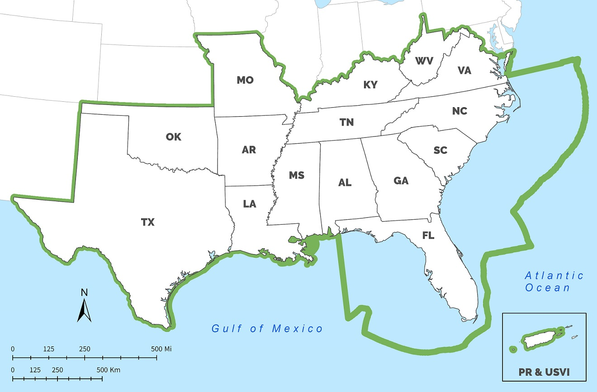

<blockquote><b>A bold vision:</b> A connected network of lands and waters that supports thriving fish and wildlife populations and improved quality of life for people  
  <b>An ambitious goal:</b> A 10% or greater improvement in the health, function, and connectivity of Southeastern ecosystems by 2060  
  <b>A Blueprint for action:</b> A data-driven spatial plan that's helping more than 500 people from over 70 organizations bring in new funding and inform their conservation decisions</blockquote>

## Who We Are

SECAS is a regional conservation initiative that spans the Southeastern United States and Caribbean. SECAS was started in 2011 by the states of the Southeastern Association of Fish & Wildlife Agencies and the federal agencies of the Southeast Natural Resource Leaders Group (<a href="http://secassoutheast.org/2019/07/22/a-brief-history-of-SECAS.html">for more information on the history of SECAS, read this blog</a>). SECAS emerged as a response to the unprecedented challenges facing our natural and cultural resources, like urban growth and climate change. We see these challenges as an opportunity to coordinate conservation action and investment around a shared strategy.

## What We Do

SECAS brings together state and federal agencies, nonprofit organizations, private businesses, tribes, partnerships, and universities around a shared vision of the future. We're working to design and achieve a connected network of lands and waters to benefit ecosystems, species, and people.

SECAS tracks regional metrics of ecosystem health, function, and connectivity to report annually on progress toward achieving <a href="../our-goal">the SECAS 10% goal</a>.

SECAS develops <a href="../blueprint">the Southeast Conservation Blueprint</a>, a living, spatial plan that identifies the most important areas for conservation and restoration across the region. It stitches together smaller subregional plans into one unifying map---a spatial action plan for achieving the SECAS vision and goal. More than 150 people from over 70 organizations have used or are using the Blueprint in their work. <a href="../story-map">Visit the SECAS in Action story map</a> to explore in-depth examples of how the Blueprint is making a difference on the ground.

  <a href="../pdf/secas-factsheet.pdf" target="_blank" title="View the SECAS factsheet">View the SECAS factsheet</a>

## SECAS Area Map

The SECAS geography.  
  

## The History of SECAS

<b>2011</b>
SECAS was initiated by the Southeastern Association of Fish and Wildlife Agencies (SEAFWA) back in Fall 2011. SEAFWA recognized the need to rally conservation partners around a common vision for sustaining natural resources in the Southeast through 2060. Ed Carter, the Executive Director of Tennessee Wildlife Resources Agency, and Cindy Dohner, Southeast Regional Director of the U.S. Fish and Wildlife Service, were strong early champions for SECAS. In May 2012, Mr. Carter invited the Southeast Natural Resource Leaders Group (SENRLG) to help lead SECAS. SENRLG agreed, establishing an early governance structure made up of SEAFWA Directors and SENRLG Principals. Together, these SECAS leaders represented the state and federal agencies working on natural resources issues in the Southeast region. Each SEAFWA Director and SENRLG Principal also chose a Point of Contact from their organization to participate in more detailed discussions and provide a complementary “bottom-up” governance framework.

<b>2013</b>
In Fall 2013, SECAS leadership set a goal of developing a first generation Southeast Blueprint for landscape-scale conservation by Fall 2016. Many different conservation planning efforts were already underway, but most eco-regional plans only covered parts of states, while state-specific plans stopped at the state line. The results of all this parallel planning did not yet add up to an integrated regional strategy.

<b>2015</b>
To help advance progress on the Blueprint and other landscape-scale conservation efforts, the Southeast Climate Adaptation Science Center funded the Vital Futures project. Vital Futures directly supported SECAS by assessing the implications of climate change and other drivers of landscape change for existing conservation goals and management objectives.

At the Fall 2015 SEAFWA annual meeting, the first ever SECAS symposium provided a status update on progress toward developing the Blueprint.

<b>2016</b>
A year later, Version 1.0 of the Southeast Blueprint was first introduced at a SECAS summit at the Fall 2016 SEAFWA annual meeting. The summit inspired so much enthusiasm that the meeting space was standing room only, with people lined up in the doorway trying to catch a glimpse! Development of this first Blueprint relied heavily on Landscape Conservation Cooperatives (LCCs) across the Southeast and Caribbean and the diverse public and private organizations participating. The involvement in LCCs of regional partnerships like the Southeast Aquatic Resources Partnership (SARP) was particularly important in integrating products and planning across LCC boundaries. This plan provided the first ever integration of spatial plans developed through the South Atlantic, Appalachian, Gulf Coastal Plains and Ozarks, Gulf Coast Prairie, North Atlantic, and Caribbean LCCs. Southeast Blueprint 1.0 was finalized and released in December 2016.

<b>2017</b>
At the Fall 2017 SEAFWA annual meeting, Version 2.0 of the Southeast Blueprint was released. This kicked off the annual process of updating SECAS products for the SEAFWA meeting every fall. Southeast Blueprint 2.0 incorporated the improved subregional Blueprints from several LCCs and established priority connections with western states through the Crucial Habitat Assessment Tool. Significant improvements over the first version included improved consistency across LCC boundaries, improved consistency in climate change response, and improved integration beyond the Southeast. The SEAFWA Directors also charged SECAS with establishing an overarching goal for the SECAS initiative. SECAS leadership and the Points of Contact had all recognized the need to identify a key objective to define what SECAS is working toward, and develop supporting near-term metrics to measure progress.

<b>2018</b>
A year later, at the Fall 2018 SEAFWA annual meeting, both the SECAS goal and Version 3.0 of the Southeast Blueprint were unveiled. The goal was developed to be both ambitious and achievable—to galvanize meaningful landscape-scale change for natural and cultural resources, while also recognizing the need to be realistic in the face of significant threats from urban growth, climate change, and more. The long-term SECAS goal called for a 10% or greater improvement in the health, function, and connectivity of Southeastern ecosystems by 2060. The near-term metrics called for a 1% improvement in the health, function, and connectivity of Southeastern ecosystems, supported by a 1% increase in conservation actions within the Blueprint, every 4 years. Version 3.0 of the Southeast Blueprint was released in February 2019 . It included full coverage of Texas, integrated threat layers covering the full Southeast, and the addition of a hubs and corridors layer covering part of the region.

As an added challenge, the development of Blueprint 3.0 and the goal occurred during a time of transition for the LCC Network where the structure and function of some LCCs was changing. Despite these changes, the capacity and commitment to continue to support Blueprint users and improve the Southeast Blueprint remained strong.

<b>2019</b>
In Fall 2019, the draft of Southeast Blueprint Version 4.0 was released at the SEAFWA annual meeting. Improvements over the previous version include: corrected overprioritization in Texas, Oklahoma, and the mountains of West Virginia and Virginia; improved priorities in the Lower Mississippi Valley, Louisiana marshes, and the Southern Appalachians; updated inputs from Florida and the Middle South subregion; expanded marine coverage to include state and federal waters around Florida; and expanded hubs and corridors that now cover all of Florida.

At the same time, SECAS unveiled the first the first ever report on progress toward achieving the 10% goal, <i><a href="../pdf/SECAS-goal-report-2019.pdf">Recent trends in Southeastern ecosystems</a></i>. 

## The Need for SECAS

The dramatic changes sweeping the Southeastern United States pose unprecedented challenges for sustaining our natural and cultural resources:

- More than 89 million people call the Southeastern United States home. The region’s population has grown roughly 40% faster than any other part of the country over the past six decades.
- If current trends continue, research predicts that urban areas in the Southeast may double in size by 2060, creating a mega-city connecting Raleigh to Atlanta.
- This rapid growth comes at the expense of fish and wildlife habitat, working lands, and the rural character of our region. By the year 2060, studies predict a loss of forest lands equal to the size of South Carolina (23 million acres).
- Sea-level rise is also contributing to coastal land loss, taking away marshes that provide nature’s best storm protection and threatening the Gulf Coast economy, which is highly intertwined with its natural resource base and provides 1/3 of the nation’s seafood.

These changes affect not only our natural world, but also our quality of life and economic well-being. We rely on healthy ecosystems and the benefits they provide society, including clean and plentiful drinking water, outdoor recreation opportunities, protection of life and property, and other resources critical to industry. Wildlife- and fish-dependent recreation alone generates an estimated \$20 billion in economic activity annually in the Southeast.

These challenges are too big for any one organization to overcome alone, but they offer a clear opportunity to rally around a shared plan. Through SECAS, conservation partners from every sector are making a collective impact to sustain our natural and cultural resources into a changing future.
