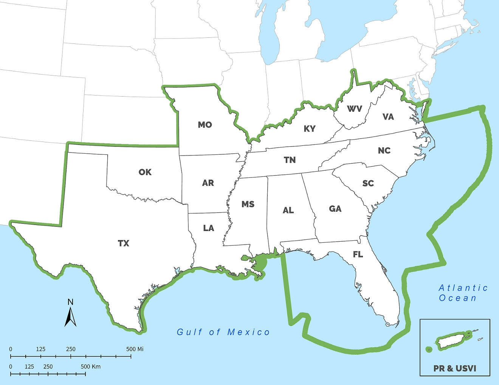

<blockquote><b>A bold vision:</b> A connected network of lands and waters that supports thriving fish and wildlife populations and improved quality of life for people  
  <b>An ambitious goal:</b> A 10% or greater improvement in the health, function, and connectivity of Southeastern ecosystems by 2060  
  <b>A Blueprint for action:</b> More than 150 people from 70 organizations have used or are using the Blueprint to help bring in new funding and inform their conservation decisions</blockquote>

## Introduction to SECAS

The dramatic changes sweeping the Southeastern United States—such as urbanization, competition for water resources, extreme weather events, sea-level rise, and climate change—pose unprecedented challenges for sustaining our natural and cultural resources. However, they also offer a clear opportunity to unite the conservation community around a shared, long- term vision for the future. The Southeast Conservation Adaptation Strategy (SECAS) is that vision. Through SECAS, diverse partners are working together to design and achieve a connected network of lands and waters that supports thriving fish and wildlife populations and improved quality of life for people across the southeastern United States and the Caribbean. Together, federal, state, nonprofit and private organizations are coordinating their conservation actions and investments to focus on common goals.

SECAS was initiated by states of the Southeastern Association of Fish & Wildlife Agencies and the federal Southeast Natural Resource Leaders Group (<a href="http://secassoutheast.org/2019/07/22/a-brief-history-of-SECAS.html">for more information on the history of SECAS, read this blog</a>). The primary product of SECAS is the Southeast Conservation Blueprint. The Blueprint stitches together smaller subregional plans into one unifying map that identifies important areas for conservation and restoration &mdash; a living spatial plan to make the SECAS vision a reality. More than 130 people from over 50 organizations have used or are using the Blueprint in their work. [Learn more about the latest version of the Blueprint]({{ "/blueprint" | prepend: site.baseurl }}). Explore [in-depth examples]({{ "/story-map" | prepend: site.baseurl }}) of how people across the region are using the Blueprint to bring in conservation funding and inform their decisions.

<a href="../pdf/secas-factsheet.pdf" target="_blank" title="Download the Factsheet" download="secas-factsheet.pdf">Download the factsheet</a>

## SECAS Area Map

The SECAS geography.  
  

## The Need for SECAS

- More than 89 million people call the Southeastern United States home. The region’s population has grown roughly 40% faster than any other part of the country over the past six decades.
- If current trends continue, research predicts that urban areas in the Southeast may double in size by 2060, creating a mega-city connecting Raleigh to Atlanta.
- This rapid growth comes at the expense of fish and wildlife habitat, working lands, and the rural character of our region. By the year 2060, studies predict a loss of forest lands equal to the size of South Carolina (23 million acres).
- Sea-level rise is also contributing to coastal land loss, taking away marshes that provide nature’s best storm protection and threatening the Gulf Coast economy, which is highly intertwined with its natural resource base and provides 1/3 of the nation’s seafood.

These changes affect not only our natural world, but also our quality of life and economic well-being. We rely on healthy ecosystems and the benefits they provide society, including clean and plentiful drinking water, outdoor recreation opportunities, protection of life and property, and other resources critical to industry. Wildlife- and fish-dependent recreation alone generates an estimated \$20 billion in economic activity annually in the Southeast.

## How the Blueprint can help you

<!-- SECAS is helping to better coordinate planning, management, and conservation actions throughout the Southeast. Photo by Brian Smith. -->

### Conservation Organizations, Natural Resource Agencies, and Regulatory Bodies

Through greater collaboration and identification of important areas to conserve and restore, the Blueprint is helping this community share data, compete more effectively for funding, and better envision and work towards a desired landscape of the future. This desired landscape sustains fish and wildlife populations, cultural resources, and ecosystem services, like drinking water and recreational opportunities, that provide essential benefits to society.

### City and Regional Planners

Increasingly, the public desires green spaces, smart growth, and wild places within or near their communities. Planners are starting to utilize the Blueprint to identify key landscapes, waterscapes, and corridors that should be preserved to conserve cultural and natural resources, protect communities from storm damage or flooding, and provide recreational opportunities—which all contribute to a greater quality of life for individuals and communities.

### Local, State, and National Government

Because they cross political boundaries, regional partnerships are uniquely positioned to tackle some of the greatest conservation challenges facing society. Collaboration within such partnerships allows for the cost-effective use of taxpayer dollars—by pooling together resources and leveraging funds among partners—as well as eliminates redundancies among programs and organizations. The Southeast Conservation Adaptation Strategy can also elevate local and state priorities to a regional level, bringing additional resources to build on existing efforts.

### Private Landowners

The Blueprint can help landowners identify opportunities for voluntary partnerships with state and federal agencies, nonprofit conservation groups, and business and industry with a common interest in sustaining private lands and keeping working lands productive. These proactive partnerships can reduce land and water resource conflicts as well as avoid the need to regulate at-risk species.

### Business and Industry

The Blueprint is starting to help businesses and industry improve their efficiency in accessing data that can inform decisions that affect fish and wildlife resources. Access to data—coupled with linkages to state and federal agencies, private landowners, and nonprofit conservation groups—can be used to proactively work on areas of common interest that not only help advance business ventures, but also help achieve the landscape of the future needed to sustain fish and wildlife populations. Information is key and the Blueprint can help with that.
