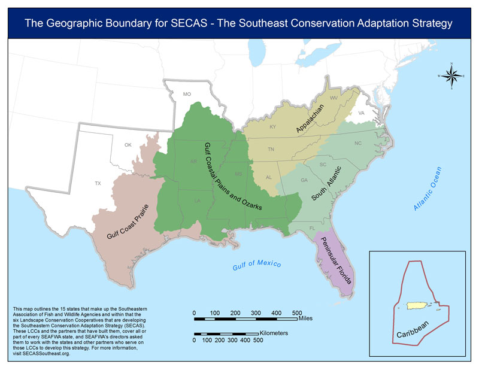

## The Need for SECAS

- More than 89 million people call the Southeastern United States home. The region’s population has grown roughly 40% faster than any other part of the country over the past six decades.
- If current trends continue, research predicts that urban areas in the Southeast may double in size by 2060, creating a mega-city connecting Raleigh to Atlanta.
- This rapid growth comes at the expense of fish and wildlife habitat, working lands, and the rural character of our region. By the year 2060, studies predict a loss of forest lands equal to the size of South Carolina (23 million acres).
- Sea-level rise is also contributing to coastal land loss, taking away marshes that provide nature’s best storm protection and threatening the Gulf Coast economy, which is highly intertwined with its natural resource base and provides 1/3 of the nation’s seafood.
- These changes affect not only our natural world, but also our quality of life and economic well-being. We rely on healthy ecosystems and the benefits they provide society, including clean and plentiful drinking water, outdoor recreation opportunities, protection of life and property, and other resources critical to industry. Wildlife- and fish-dependent recreation alone generates an estimated $20 billion in economic activity annually in the Southeast.

<a href="../pdf/secas-factsheet.pdf" target="_blank" title="Download the Factsheet">Learn More</a>

## The SECAS vision

The dramatic changes sweeping the Southeastern United States — such as urbanization, competition for water resources, extreme weather events, sea-level rise, and climate change — pose unprecedented challenges for sustaining our natural and cultural resources. However, they also offer a clear opportunity to unite the conservation community around a shared, long- term vision for the future. The Southeast Conservation Adaptation Strategy (SECAS) is that vision. Through SECAS, diverse partners are working together to design and achieve a connected network of landscapes and seascapes that supports thriving fish and wildlife populations and improved quality of life for people across the southeastern United States and the Caribbean. Together, federal, state, non-profit and private organizations are coordinating their conservation actions and investments to focus on common goals.

SECAS was initiated by states of the Southeastern Association of Fish &amp; Wildlife Agencies and the federal Southeast Natural Resource Leaders Group with support from Southeast and Caribbean Landscape Conservation Cooperatives (LCCs) and the Southeast Aquatic Resources Partnership.

In October of 2016, SECAS achieved a major milestone with the release of a first draft of a conservation blueprint for the Southeast and Caribbean. This blueprint stitches together the conservation and restoration priorities of multiple LCCs in the region into one unifying map — a living spatial plan to make the SECAS vision a reality. Whether you are an urban planner, a private landowner, a non-profit advocate, a public lands manager, or anyone else committed to sustaining our natural and cultural heritage for future generations, join the SECAS conversation at [secassoutheast.org](http://secassoutheast.org).

## SECAS Area Map

[Download high-resolution map.](./images/area-map-v4-lg.jpg)
