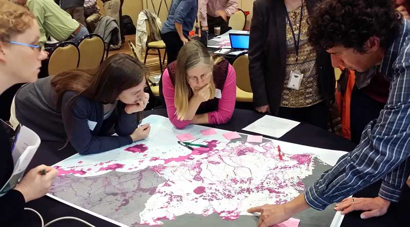
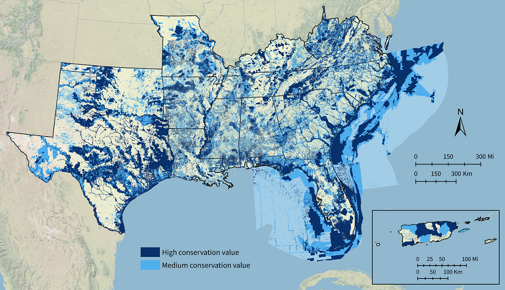
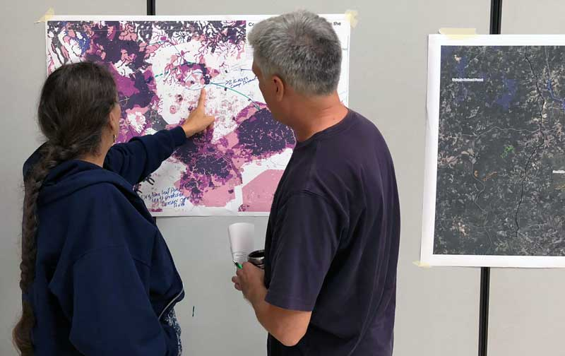
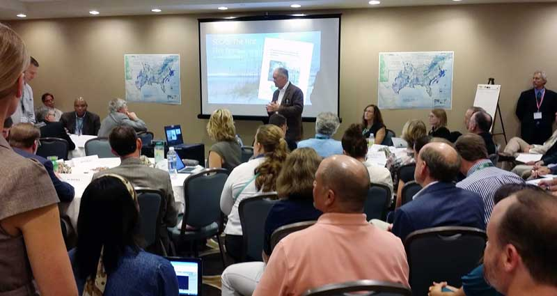

<blockquote>The Blueprint is a living, spatial plan that identifies important places for conservation and restoration across the Southeast and Caribbean. It's helping more than 250 people from over 100 organizations bring in new funding and inform their conservation decisions.</blockquote>

<figure>
  
  <figcaption>Conservation professionals review a draft of the Conservation Blueprint in the South Atlantic subregion.</figcaption>
</figure>

The Southeast Conservation Blueprint is more than just a map. It’s a living, spatial plan that identifies important areas for conservation and restoration across the Southeast and Caribbean. Over 250 people from more than 100 organizations have used or are using the Blueprint in their work. The Southeast Blueprint has helped bring in more than $40 million in conservation funding to protect and restore over 75,000 acres.

The Blueprint stitches together smaller subregional plans into one consistent map, incorporating the best available information about the current condition of key species and habitats, as well as future threats. Because the Blueprint is a living plan, it will evolve over time, driven by improvements to the underlying science, our growing understanding of on-the-ground conditions, and input from new partners. So far, more than 1,700 people from 500 different organizations have actively participated in developing the Southeast Blueprint.

## Blueprint Version 2020

  

  <a href="https://blueprint.geoplatform.gov/southeast/" target="_blank" title="Start Simple in our beta viewer">Start simple in our beta viewer</a>

  <a href="https://seregion.databasin.org/galleries/5d5eb2989ea14a9f8df3ebb619fe470c" target="_blank" title="Dig deeper in our atlas">Dig deeper in our atlas</a>

  <a href="https://www.sciencebase.gov/catalog/file/get/5f85ac4582cebef40f14c541?name=SE_Blueprint2020_DataDownload.zip" target="_blank" title="Download the GIS data">Download the GIS data</a>

Southeast Blueprint 2020 was released in October 2020 at the virtual annual meeting of the Southeastern Association of Fish and Wildlife Agencies. Significant improvements over the previous versions include: finer resolution and a more connected network of priorities in the inland South Atlantic subregion; updated data and a more consistent approach to cross-state prioritization in the Middle Southeast subregion; and better integration in areas of overlap between the South Atlantic Blueprint, Florida Blueprint, and Nature's Network design. For a full list of everything that changed in Version 2020, <a href="https://www.sciencebase.gov/catalog/file/get/5dc440b3e4b0695797584b9f?name=SE_Blueprint_Changelog.pdf">check out the Southeast Blueprint changelog</a>. You can <a href="https://seregion.databasin.org/galleries/5d5eb2989ea14a9f8df3ebb619fe470c">explore and download the data on the Southeast Conservation Planning Atlas</a> (CPA), a free online mapping platform. Here, you can also read more about the methods and underlying datasets used to create Version 2020, and check out <a href="http://www.sciencebase.gov/catalog/file/get/5c81380ce4b0938824476207?name=SoutheastBlueprintUserGuide.pdf">a user guide</a> full of ideas about how to apply it to your own work.

<figure>
  
  <figcaption><a href="https://seregion.databasin.org/galleries/5d5eb2989ea14a9f8df3ebb619fe470c">Southeast Blueprint Version 2020</a> identifies high value areas for conservation and restoration across the Southeast and Caribbean.</figcaption>
</figure>

### Blueprint categories

**High conservation value:** These areas are the most important for ecosystem health, function, and connectivity.
**Medium conservation value:** This category captures areas that might require more restoration, but are important for buffering high value areas and maintaining connectivity.

### A few things to keep in mind as you explore the Blueprint

- The Blueprint identifies lands and waters that have high conservation value. A range of conservation activities could benefit those priority areas, including management, economic incentives, and protection. The Blueprint should not be interpreted as a plan for land acquisition.
- The Blueprint is not intended to be used in isolation of other datasets. Instead, it provides a regional perspective that, in combination with local data and knowledge, can help inform decisions about where to focus conservation action in the face of future change.
- If you want to find your piece of the Blueprint, depending on where you’re looking, you can explore the subregional Blueprint inputs and underlying datasets. These underlying layers can help you understand the important areas for birds, water quality, climate resilience, prescribed burning, reforestation, and much more. These other layers can help you tell the unique story of what makes your area of interest special. [Contact Blueprint staff](https://secassoutheast.org/contact) if you’d like some help.
- As a living spatial plan, the Blueprint is always a work in progress. We maintain a list of the problems with the Blueprint that have been identified in the review process so far. Those “known issues” are captured below and [in the Blueprint documentation on the Conservation Planning Atlas](https://seregion.databasin.org/galleries/5ada9ba2aefe4151aefba9aa877b2664). The Blueprint will continue to be refined to incorporate updates to the input layers and feedback from Blueprint users and other partners.

### Input data

Version 2020 of the Southeast Blueprint integrates the following plans:

- Florida Blueprint 1.3: [Learn more and access the data in the Blueprint 1.3 Gallery on the Florida CPA](https://flcpa.databasin.org/galleries/20b5bfb654ee426b84165e9228c4009c)
- The South Atlantic Conservation Blueprint 2020: [Learn more about the South Atlantic Blueprint](http://www.southatlanticlcc.org/blueprint/) and [access the data in the Blueprint 2020 Gallery on the South Atlantic CPA](https://salcc.databasin.org/galleries/50e3abe922a74c9e9b6d0167dd1e8f2e)
- The North Atlantic Nature’s Network Conservation Design: [Learn more about Nature’s Network](http://naturesnetwork.org/) and [access the data on the Northeast CPA](https://nalcc.databasin.org/datasets/3d670fad4c924e7ba2ae02f04a128256)
- The Crucial Habitat Assessment Tool (CHAT): [Learn more and access the data on the CHAT website](http://www.wafwachat.org/)
- The Appalachian NatureScape Design (Phase II): [Learn more about NatureScape](http://applcc.org/plan-design/conservation-design) and [access the data on the Northeast CPA](https://nalcc.databasin.org/datasets/22cda640930c4692a9dc1413b201ccc1) (note: the Phase II NatureScape Design was combined with portions of [The Nature Conservancy’s Resilient and Connected Landscapes](https://www.conservationgateway.org/ConservationByGeography/NorthAmerica/UnitedStates/edc/reportsdata/terrestrial/resilience/Pages/default.aspx) “Prioritized Network” layer)
- Middle Southeast Blueprint 2020: [Learn more and access the data on ScienceBase](https://www.sciencebase.gov/catalog/item/5dc5040ee4b069579758510b)
- The Gulf Hypoxia Precision Conservation Blueprint v1.5 Sum - Conservation and Watershed Interests (2016) layer: [Learn more on the LCC Network Science Catalog and access the data on DataBasin](https://lccnetwork.org/resource/mississippi-river-basingulf-hypoxia-initiative-precision-conservation-blueprint)
- The Caribbean Landscape Conservation Design: [Learn more about the process and data used to develop the Caribbean LCD](https://caribbeanlcc.databasin.org/galleries/ecb079d09f5a430fafc2d48d68bdf1b4#expand=131288) (note: full data beyond the two pilot watersheds is available on request by emailing Daniel Adams at [daniel_adams@fws.gov](mailto:daniel_adams@fws.gov))
- Florida Marine Blueprint 1.0: [Learn more and access the data in the Marine Blueprint Gallery on the Florida CPA](https://flcpa.databasin.org/galleries/1bf67d31d64448b6a255888f43f3d601)

### Known issues

Here are the known issues identified in Southeast Blueprint 2020:

- Open water areas in the Chesapeake Bay and nearshore marine areas of Virginia are underprioritized. There was no available layer depicting where the analysis area ended for Nature’s Network in this area of Virginia. This resulted in some areas that should be NoData classified as 0.
- Corridors are underprioritized in the western part of the SECAS geography since only the South Atlantic, North Atlantic, Appalachian, and Florida Blueprint inputs formally include corridors. Work is underway in the Middle Southeast (formerly Gulf Coastal Plains and Ozarks) subregion to create a hubs and corridors layer, but the data was not available in time for this Blueprint release.
- Adaptation to climate change (not related to sea-level rise) is not formally included in the western part of the Southeast Blueprint as only the South Atlantic, North Atlantic, Appalachian, and Florida Blueprint inputs specifically incorporate it.
- Approaches to addressing urban growth and sea-level rise vary across the different inputs in the Southeast Blueprint. For example, in the Middle Southeast Blueprint, an index of future urbanization reduces the priority. Future sea-level rise either increases or decreases the priority depending on the ecosystem. In the Florida Blueprint, future urban growth does not directly impact priority. Future sea-level rise is addressed through corridors facilitating coastal to inland connectivity developed in Florida CLIP. In the South Atlantic Blueprint, a majority of people felt conservation actions were important in priority areas predicted to change due to urban growth and sea-level rise and did not want to reduce the priority there. Instead of changing the priority, the approach to change is to work together to make sure actions taken based on the Blueprint are the best balance of “high urgency” places predicted to change, and “low risk” places less likely to change. Discussions about how to best integrate strategies for change across the full region are ongoing.
- Native prairie is underprioritized in Oklahoma and the South Piedmont. This is due to the species used in the Oklahoma CHAT and the difficulty of identifying certain Piedmont prairies with remote sensing.
- Aquatic species are underprioritized in Oklahoma due to the species used in the Oklahoma CHAT.
- Blueprint priorities for coastal marshes in Louisiana are higher farther south and closer to the ocean; however, the coastal marsh priorities should probably be higher farther north and farther from the ocean.
- While the input data from each subregional Blueprint input is intended to identify areas of high and medium conservation value, approaches and methods vary. As a result, specific definitions of “high conservation value” also vary.
- In [the Middle Southeast input to the Southeast Blueprint](https://www.sciencebase.gov/catalog/item/5f7cae2882ce1d74e7db5493), an error was made in the spatial rebalancing process. As a result, areas with high aquatic value, but lower terrestrial value, are undervalued across in the final Southeast Blueprint compared to their priority in Middle Southeast Blueprint 2020. This error in the ranking process was discovered too late in the process of finalizing the Southeast Blueprint to be fixed in time for this version. We recommend that anyone in the Middle Southeast geography who wants to use the Blueprint to support their conservation decisions [contact user support](http://secassoutheast.org/contact) or use [Middle Southeast Blueprint 2020](https://www.sciencebase.gov/catalog/item/5dc5040ee4b069579758510b) directly instead of the full Southeast Blueprint.

## Contact Blueprint staff

Do you have a question about the Blueprint? Would you like help using the Blueprint to support a proposal or inform a decision? Staff across the Southeast are here to support you! You can also explore the [Online Guide to using the Southeast Blueprint](https://www.sciencebase.gov/catalog/file/get/5c81380ce4b0938824476207?name=SoutheastBlueprintUserGuide.pdf), which will walk you through how to use it on your own.

The Blueprint is also revised based on input from people like you. So if you have a suggestion on how to improve the Blueprint, let us know!

To get help or provide feedback, [visit the contact page to reach out to the staff person working in your state]({{ "/contact" | prepend: site.baseurl }}).

## Who’s using the Blueprint

<figure>
  
  <figcaption>During a joint meeting of the NC Sandhills Conservation Partnership, Greater Uwharrie Conservation Partnership, and NC Longleaf Coalition, members of a connectivity breakout group use the Blueprint to identify potential corridors to connect longleaf priority areas in the Uwharries and Sandhills.</figcaption>
</figure>

Specific examples of how the Blueprint has been used include:

- A regional Council of Government used the Blueprint to help a town refine the natural habitat cores in their comprehensive plan.
- A National Wildlife Refuge Manager used the Blueprint to support a proposal for funding to help recover an endangered salamander.
- A private company used the Blueprint in a confidential analysis to support its business.
- A state wildlife agency used the Blueprint to support a proposal for funding to protect coastal wetlands and improve public access to recreation opportunities.
- Longleaf pine conservation partnerships used the Blueprint to identify restoration and management priorities.
- A nonprofit organization used the Blueprint to support a critical source of conservation funding at its state legislature.
- A National Forest used the Blueprint to inform its public lands planning.

These are just a few of the over 100 Blueprint uses completed so far, with more than 60 still in progress! For more in-depth examples of how the Blueprint is being used, [check out the SECAS in Action story map]({{ "/story-map" | prepend: site.baseurl }}). You can also <a href="../organizations-using-the-blueprint">see a detailed list of the organizations using the Blueprint</a>.

## The history of the Blueprint

<figure>
  
  <figcaption>Ed Carter, Executive Director of the Tennessee Wildlife Resources Agency, speaks about the history and importance of SECAS alongside Cindy Dohner, Southeast Regional Director of the U.S. Fish and Wildlife Service. This SECAS symposium took place at the 2016 SEAFWA annual meeting.</figcaption>
</figure>

In the fall of 2013, SECAS leadership set a goal of developing a first generation Southeast Blueprint for landscape-scale conservation by the fall of 2016. Many different conservation planning efforts were already underway, but most eco-regional plans only covered parts of states, while state-specific plans stopped at the state line. The results of all this parallel planning did not yet add up to an integrated regional strategy.

Three years later, Version 1.0 of the Southeast Blueprint was released in December 2016. Development of this first Blueprint relied heavily on Landscape Conservation Cooperative (LCC) partnerships across the Southeast and Caribbean. This plan provided the first ever integration of spatial plans developed through the South Atlantic, Appalachian, Gulf Coastal Plains and Ozarks, Gulf Coast Prairie, North Atlantic, and Caribbean LCCs.

Version 2.0 of the Southeast Blueprint was released in November 2017. This plan incorporated the improved subregional Blueprints from several LCCs and established priority connections with western states through the Crucial Habitat Assessment Tool. Significant improvements over Version 1.0 included improved consistency across LCC boundaries, improved consistency in climate change response, and improved integration beyond the Southeast.

Version 3.0 of the Southeast Blueprint was first introduced at the October 2018 SEAFWA annual meeting, and officially released in February 2019. Its development occurred during a time of transition for the LCC Network where the structure and function of some LCCs was changing. Despite these changes, the capacity and commitment to continue to support Blueprint users and improve the Southeast Blueprint remains strong, evidenced by the many examples of Blueprint implementation, as well as progress on Blueprint improvements. Blueprint 3.0 added full coverage of Texas, integrated threat layers covering the full Southeast, and a hubs and corridors layer covering part of the region.

Version 4.0 of the Southeast Blueprint was released in October 2019 at the SEAFWA annual meeting. Improvements over the previous version include: corrected overprioritization in Texas, Oklahoma, and the mountains of West Virginia and Virginia; improved priorities in the Lower Mississippi Valley, Louisiana marshes, and the Southern Appalachians; updated inputs from Florida and the Middle South subregion; expanded marine coverage to include state and federal waters around Florida; and expanded hubs and corridors that now cover all of Florida.

Southeast Blueprint 2020 was released in October 2020 at the virtual annual meeting of the Southeastern Association of Fish and Wildlife Agencies. Significant improvements over the previous versions include: finer resolution and a more connected network of priorities in the inland South Atlantic subregion; updated data and a more consistent approach to cross-state prioritization in the Middle Southeast subregion; and better integration in areas of overlap between the South Atlantic Blueprint, Florida Blueprint, and Nature's Network design.

The next version of the Southeast Blueprint is expected in the fall of 2021. It continues the ongoing evolution toward better integration across the various Blueprint inputs and regular updates based on the best available information.
