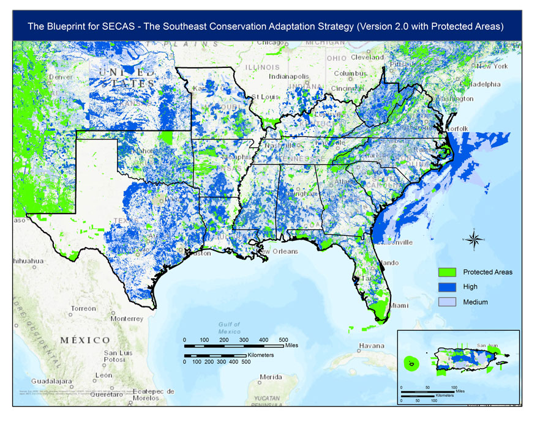

<figure class="image-right">
  
  <figcaption>Conservation professionals weigh in on important resources in the South Atlantic LCC.</figcaption>
</figure>

The SECAS Blueprint stitches together the work of multiple Landscape Conservation Cooperatives (LCCs) into a map of shared conservation and restoration priorities across the Southeast and Caribbean. Just as a construction blueprint serves as a plan for achieving an architect’s design of a building, our Blueprint serves as a plan for making the SECAS vision a reality. The Blueprint combines multiple datasets, tools, and resources into one cohesive map that can be shared by regional planners, highway departments, developers, businesses, and conservation professionals alike. By providing regional context for local decisions, it will help organizations with different goals find common ground — opportunities to align their efforts to protect fish and wildlife habitat, improve quality of life for people, safeguard life and property, and develop strong economies. As the Blueprint informs the decisions affecting our communities, our livelihoods, and our natural and cultural heritage, it will shape a more sustainable future for our region.

Hundreds of people representing a diverse range of organizations have actively participated in developing the components of the SECAS Blueprint so far. It incorporates the best available information about the current condition of key species and habitats, as well as future threats. Since the Blueprint is a living document, these mapped priorities will evolve over time, driven by improvements to the underlying science, our growing understanding of on-the-ground conditions, and input from new partners.  Check out the initial draft of this Blueprint below, a key early product of SECAS.

## Blueprint Map 1.0

Southeast regional conservation leaders this month announced an important step forward in the development of the Southeast Conservation Adaptation Strategy (SECAS) during the 2016 Southeastern Association of Fish and Wildlife Agencies’ annual meeting in Baton Rouge, Louisiana.  SECAS is the work product of 15 state fish and wildlife agencies, a dozen federal agencies, six Landscape Conservation Cooperatives (LCCs), and more than a dozen conservation groups working through the LCCs.   An initial version of the SECAS map is below.

Here are several notes to consider when looking at the map:

 - The Blueprint represents lands with high conservation value; it does not represent an acquisition boundary.
 - A fairly significant amount of the "high" scoring area is already in the conservation estate in both Florida (~53%) and in the Appalachians (~24%).
 - There are many potential conservation layers embedded within the Blueprint map such as prescribed burning and reforestation.  When separated out, a much smaller subset of the Blueprint map is relevant.
 - The "medium" scoring areas are important for promoting and maintaining connectivity.
 - The Blueprint is being refined as this collaborative partnership work moves forward and significant efforts are already underway across the region.

<figure>
  
  <figcaption>The <a href="./images/secas-blueprint-2-full-res.jpg" target="_blank">SECAS Blueprint map</a> depicts areas that scored high or medium under the blueprint as well as existing protected areas. <a href="https://seregion.databasin.org/datasets/c237c946ba0c49b0957cffea1bfb7ad7" target="_blank">Download blueprint data</a>.</figcaption>
</figure>

## How Can the Blueprint be Used?

The Blueprint can be used by local governments, transportation planners, developers, private businesses, federal and state agencies, nonprofits, and many other groups to help answer challenging questions, such as:

- What are the most crucial areas to conserve today for species of greatest conservation need, proactively reducing the need for future protection?
- Where are the best places for smart urban growth that minimize negative impacts to fish and wildlife, conserve clean and plentiful drinking water, and provide greater access to open space?
- How does public and private land conservation contribute to a connected network of lands and waters across the region?
- Where would stream restoration provide the most benefits to fish, human health, and outdoor recreation?
- Where should we focus conservation efforts now to improve the resilience of ecosystems and communities in advance of major disasters like hurricanes and oil spills?
- Where will economic incentives achieve the most conservation benefits on working lands?

[Download the blueprint data now](https://seregion.databasin.org/datasets/c237c946ba0c49b0957cffea1bfb7ad7).

## What tools are available?

### Blueprints or Conservation Designs
- [Appalachian LCC](http://applcc.org/conservation-design/conservation-design)
- [Caribbean LCC](http://caribbeanlcc.org/)
- [Gulf Coastal Plains &amp; Ozarks LCC](http://gcpolcc.org/blueprint-1-0)
- [Gulf Coast Prairie LCC](http://gulfcoastprairielcc.org/science/)
- [Peninsular Florida LCC](http://peninsularfloridalcc.org/page/science-plan)
- [South Atlantic LCC](http://www.southatlanticlcc.org/blueprint/)

### Conservation Planning Atlases

A Conservation Planning Atlas (CPA) is a science-based mapping platform where conservation managers and LCC members can go to view, retrieve, and perform analyses on spatial information with specific conservation goals in mind. Additionally, you can upload your own data to your account to be used in conjunction with these datasets.

Each CPA provides a platform for LCCs to create galleries to showcase a cohesive collection of spatial information and supporting documentation. Several galleries are being showcased at each portal.

- [Appalachian LCC](https://nalcc.databasin.org/galleries/4a9cde6909894d8da702370bedc4aaba)
- [Southeast Region](https://seregion.databasin.org/)
- [Caribbean LCC](http://caribbeanlcc.org/clcc-atlas/)
- [Gulf Coastal Plains &amp; Ozarks LCC](https://gcpolcc.databasin.org/)
- [Gulf Coast Prairie LCC](https://gcplcc.databasin.org/)
- [Peninsular Florida LCC](http://peninsularfloridalcc.org/page/cpa)
- [South Atlantic LCC](https://salcc.databasin.org/)

<figure>
  
  <figcaption>Experts gather for the Blueprint Workshop in Caddo Lake, TX. Photo by Greg Wathen.</figcaption>
</figure>
