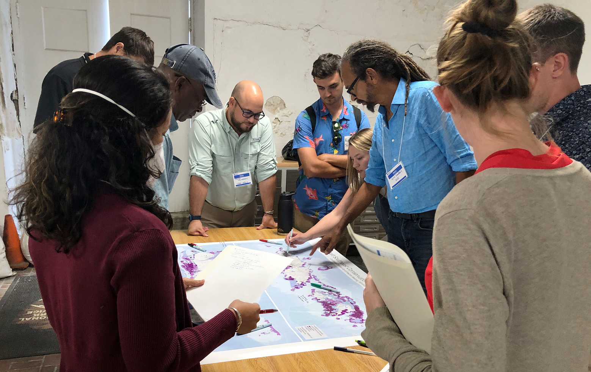
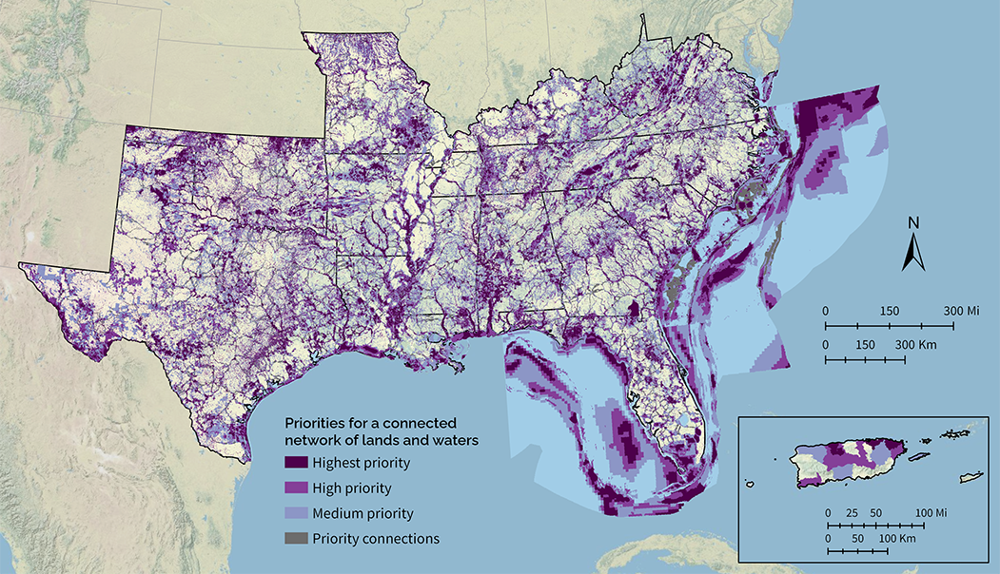

<blockquote><b>Review draft Blueprint 2023 at a workshop in May! <a href="http://secassoutheast.org/workshops">Learn more and register!</a></b>  The Blueprint is a living, spatial plan that identifies priority areas for a connected network of lands and waters across the Southeast and Caribbean. It's helping more than 300 people from over 130 organizations bring in new funding and inform their conservation decisions.</blockquote>

<figure>
  
  <figcaption>Conservation professionals review an early draft of Southeast Conservation Blueprint 2023 in the U.S. Virgin Islands at <a href="http://secassoutheast.org/2023/02/24/Caribbean-Community-of-Practice-kickoff-meeting-in-Christiansted-St-Croix.html">a meeting of the Caribbean Community of Practice in Christiansted, St. Croix</a>. Photo by Rua Mordecai.</figcaption>
</figure>

The Southeast Conservation Blueprint is the primary product of SECAS. The Blueprint is more than just a map. It’s a living spatial plan to achieve the SECAS vision of a connected network of lands and waters across the Southeast and Caribbean. More than 300 people from over 130 organizations have used or are using the Blueprint in their work. So far, the Southeast Blueprint has helped bring in more than $80 million in conservation funding to protect and restore over 100,000 acres.

The Blueprint identifies priority areas based on [a suite of natural and cultural resource indicators](https://secassoutheast.org/pdf/IndicatorCheatSheet_2022.pdf) representing terrestrial, freshwater, and marine ecosystems. Across most of the region, a connectivity analysis identifies corridors that link coastal and inland areas and span climate gradients. Because the Blueprint is a living plan, it will evolve over time, driven by improvements to the underlying science, our growing understanding of on-the-ground conditions, and input from new partners. So far, more than 2,000 people from over 500 different organizations have actively participated in developing the Southeast Blueprint.

## Blueprint Version 2022

  

  <a href="https://blueprint.geoplatform.gov/southeast/" target="_blank" title="Start simple in the Explorer">Start simple in the Explorer</a>

  <a href="https://secas-fws.hub.arcgis.com/pages/blueprint" target="_blank" title="Dig deeper in our atlas">Dig deeper in our atlas</a>

  <a href="https://www.sciencebase.gov/catalog/file/get/62d57290d34e87fffb2dda52?name=Southeast_Blueprint_2022_Data_Download.zip" target="_blank" title="Download the GIS data">Download the GIS data</a>

Southeast Blueprint 2022 was released in October 2022 at the annual meeting of the Southeastern Association of Fish and Wildlife Agencies. Rather than continuing to stitch together so many different subregional plans, the 2022 Blueprint took massive strides toward regional consistency by using the same methods and indicators across 15 states of the Southeast. To provide more complete coverage of the SECAS geography, it also incorporated two additional input plans: the latest update to the Florida Marine Blueprint for marine areas in Florida and the Caribbean Landscape Conservation Design for inland areas in Puerto Rico. For a full list of everything that changed in Version 2022, <a href="https://www.sciencebase.gov/catalog/file/get/5dc440b3e4b0695797584b9f?name=SE_Blueprint_Changelog.pdf">check out the Southeast Blueprint changelog</a>.

  

You can <a href="https://secas-fws.hub.arcgis.com/pages/blueprint">explore and download the data on the Blueprint page of the SECAS Atlas</a>, a free online mapping platform. Here, you can also read more about the methods and underlying datasets used to create Version 2022.

<figure>
  
  <figcaption><a href="https://secas-fws.hub.arcgis.com/pages/blueprint">Southeast Conservation Blueprint Version 2022</a> identifies priority areas for a connected network of lands and waters across the Southeast and Caribbean.</figcaption>
</figure>

### Blueprint categories

- **Highest priority:** Areas where conservation action would make the biggest impact, based on a suite of natural and cultural resource indicators. This class covers roughly 10% of the Southeast Blueprint geography.  
- **High priority:** Areas where conservation action would make a big impact, based on a suite of natural and cultural resource indicators. This class covers roughly 15% of the Southeast Blueprint geography.  
- **Medium priority:** Areas where conservation action would make an above-average impact, based on a suite of natural and cultural resource indicators. This class covers roughly 20% of the Southeast Blueprint geography.  
- **Priority connections:** Connections between priority areas that cover the shortest distance possible while routing through as much Blueprint priority as possible. This class covers roughly 5% of the Southeast Blueprint geography.

### A few things to keep in mind as you explore the Blueprint

- The Blueprint identifies areas where conservation action would have the biggest impact for a connected network of lands and waters. A range of conservation activities could benefit those priority areas, including management, economic incentives, and protection. The Blueprint should not be interpreted as a plan for land acquisition.
- The Blueprint is not intended to be used in isolation of other datasets. Instead, it provides a regional perspective that, in combination with local data and knowledge, can help inform decisions about where to focus conservation action in the face of future change.
- If you want to find your piece of the Blueprint, in most areas, you can explore the underlying indicator and connectivity data. These underlying layers can help identify important areas for corridors, birds, water quality, climate resilience, prescribed burning, reforestation, and much more. They can help you tell the unique story of what makes your area of interest special. [Contact a member of Blueprint user support staff](https://secassoutheast.org/staff) if you’d like some help.
- As a living spatial plan, the Blueprint is always a work in progress. We maintain a list of the problems with the Blueprint that have been identified in the review process so far. Those “known issues” are captured on [the known issues page](https://secassoutheast.org/blueprint-known-issues) and in the [Southeast Blueprint 2022 Development Process](https://www.sciencebase.gov/catalog/file/get/62d5816fd34e87fffb2dda77?name=Southeast_Blueprint_2022_Development_Process.pdf) final report. The Blueprint will continue to be refined to incorporate improvements to the input data and methods, as well as feedback from Blueprint users and other partners.

### Input data

Across 15 states of the Southeast, Version 2022 of the Southeast Blueprint identifies priority areas based on [a suite of natural and cultural resource indicators](https://secassoutheast.org/pdf/IndicatorCheatSheet_2022.pdf) representing terrestrial, freshwater, and marine ecosystems. A connectivity analysis identifies corridors that link coastal and inland areas and span climate gradients. This portion of the Southeast Blueprint is referred to as the "Base Blueprint". 

To provide more complete coverage of the SECAS geography, the Blueprint incorporates two additional input plans: the Florida Marine Blueprint for marine areas in Florida and the Caribbean Landscape Conservation Design (LCD) for inland areas in Puerto Rico. Florida Marine Blueprint 2.0 is available on the [Florida Conservation Planning Atlas](https://flcpa.databasin.org/) (CPA). [More information on the Caribbean LCD is available on the Caribbean CPA](https://caribbeanlcc.databasin.org/galleries/ecb079d09f5a430fafc2d48d68bdf1b4/). The full Caribbean LCD watershed ranking used in the Southeast Blueprint is available in the [Southeast Blueprint 2022 Data Download](https://www.sciencebase.gov/catalog/file/get/62d57290d34e87fffb2dda52?name=Southeast_Blueprint_2022_Data_Download.zip).

### Known issues
As a living spatial plan, the Blueprint is always a work in progress. We maintain a list of the problems with the Blueprint that have been identified in the review process so far, which we call “known issues”. These known issues are part of our commitment to transparently documenting the Blueprint’s strengths and weaknesses. They also help us prioritize the most important issues to fix in the next update cycle.

The known issues identified with Southeast Conservation Blueprint 2022 are captured on [the known issues page](https://secassoutheast.org/blueprint-known-issues) and in the [Southeast Blueprint 2022 Development Process](https://www.sciencebase.gov/catalog/file/get/62d5816fd34e87fffb2dda77?name=Southeast_Blueprint_2022_Development_Process.pdf) final report.

## Contact Blueprint staff

Do you have a question about the Blueprint? Would you like help using the Blueprint to support a proposal or inform a decision? Staff across the Southeast are here to support you! You can also explore the [Online Guide to using the Southeast Blueprint](https://www.sciencebase.gov/catalog/file/get/5c81380ce4b0938824476207?name=SoutheastBlueprintUserGuide.pdf), which will walk you through how to use it on your own.

The Blueprint is also revised based on input from people like you. So if you have a suggestion on how to improve the Blueprint, let us know!

To get help or provide feedback, [visit the staff page to contact a user support team member]({{ "/staff" | prepend: site.baseurl }}).

## Who’s using the Blueprint

<figure>
  
  <figcaption>During a joint meeting of the NC Sandhills Conservation Partnership, Greater Uwharrie Conservation Partnership, and NC Longleaf Coalition, members of a connectivity breakout group use the Blueprint to identify potential corridors to connect longleaf priority areas in the Uwharries and Sandhills.</figcaption>
</figure>

Specific examples of how the Blueprint has been used include:

- A regional Council of Government used the Blueprint to help a town refine the natural habitat cores in their comprehensive plan.
- A broad coalition of 49 military and conservation partners used the Blueprint to help establish a new Sentinel Landscapes Partnership. 
- A local African American community organization used the Blueprint to help communicate the natural resource benefits of a cultural heritage trail.
- A watershed partnership used the Blueprint to help develop a land protection strategy.
- A National Wildlife Refuge Manager used the Blueprint to support a proposal for funding to help recover an endangered salamander.
- A private company used the Blueprint in a confidential analysis to support its business.
- A state wildlife agency used the Blueprint to support a proposal for funding to protect coastal wetlands and improve public access to recreation opportunities.
- Longleaf pine conservation partnerships used the Blueprint to identify restoration and management priorities.
- A nonprofit organization used the Blueprint to support a critical source of conservation funding at its state legislature.
- A National Forest used the Blueprint to inform its public lands planning.

These are just a few of the over 150 Blueprint uses completed so far, with more than 60 still in progress! For more in-depth examples of how the Blueprint is being used, [check out the SECAS in Action story map]({{ "/story-map" | prepend: site.baseurl }}). You can also <a href="../organizations-using-the-blueprint">see a detailed list of the organizations using the Blueprint</a>.

## The history of the Blueprint

<figure>
  
  <figcaption>Ed Carter, Executive Director of the Tennessee Wildlife Resources Agency, speaks about the history and importance of SECAS alongside Cindy Dohner, Southeast Regional Director of the U.S. Fish and Wildlife Service. This SECAS symposium took place at the 2016 annual conference of the Southeastern Association of Fish and Wildlife Agencies (SEAFWA).</figcaption>
</figure>

In the fall of 2013, SECAS leadership set a goal of developing a first-generation Southeast Blueprint for landscape-scale conservation by the fall of 2016. Many different conservation planning efforts were already underway, but most eco-regional plans only covered parts of states, while state-specific plans stopped at the state line. The results of all this parallel planning did not yet add up to an integrated regional strategy.

Three years later, Version 1.0 of the Southeast Blueprint was released in December 2016. Development of this first Blueprint relied heavily on Landscape Conservation Cooperative (LCC) partnerships across the Southeast and Caribbean. This plan provided the first ever integration of spatial plans developed through the South Atlantic, Appalachian, Gulf Coastal Plains and Ozarks, Gulf Coast Prairie, North Atlantic, Peninsular Florida and Caribbean LCCs. It also included priorities from the Mississippi River Basin/Gulf Hypoxia Initiative spearheaded by seven LCCs (Appalachian, Eastern Tallgrass Prairie and Big Rivers, Great Plains, Gulf Coast Prairie, Gulf Coastal Plains and Ozarks, Plains and Prairie Potholes, and Upper Midwest and Great Lakes).

Version 2.0 of the Southeast Blueprint was released in November 2017. This plan incorporated the improved subregional Blueprints from several LCCs and established priority connections with western states through the Crucial Habitat Assessment Tool. Significant improvements over Version 1.0 included improved consistency across LCC boundaries, improved consistency in climate change response, and improved integration beyond the Southeast.

Version 3.0 of the Southeast Blueprint was first introduced at the October 2018 SEAFWA annual conference, and officially released in February 2019. Its development occurred during a time of transition for the LCC Network where the structure and function of some LCCs was changing. Despite these changes, the capacity and commitment to continue to support Blueprint users and improve the Southeast Blueprint remains strong, evidenced by the many examples of Blueprint implementation, as well as progress on Blueprint improvements. Blueprint 3.0 added full coverage of Texas, integrated threat layers covering the full Southeast, and a hubs and corridors layer covering part of the region.

Version 4.0 of the Southeast Blueprint was released in October 2019 at the SEAFWA annual conference. Improvements over the previous version included: corrected overprioritization in Texas, Oklahoma, and the mountains of West Virginia and Virginia; improved priorities in the Lower Mississippi Valley, Louisiana marshes, and the Southern Appalachians; updated inputs from Florida and the Middle South subregion; expanded marine coverage to include state and federal waters around Florida; and expanded hubs and corridors that now cover all of Florida.

Southeast Blueprint 2020 was released in October 2020 at the virtual SEAFWA annual conference. Significant improvements over the previous versions included: finer resolution and a more connected network of priorities in the inland South Atlantic subregion; updated data and a more consistent approach to cross-state prioritization in the Middle Southeast subregion; and better integration in areas of overlap between the South Atlantic Blueprint, Florida Blueprint, and Nature's Network design.

Southeast Blueprint 2021 was released in November 2021 following the virtual SEAFWA annual conference. Significant improvements over the previous versions included: updated and improved indicators, better incorporation of equity, deep-sea coral, fire, and important grasslands, and multiple connectivity improvements in the South Atlantic subregion, as well as correcting a scoring issue in the Middle Southeast subregion.

Southeast Blueprint 2022 was released in October 2022 at the SEAFWA annual conference. Rather than continuing to stitch together so many different subregional plans, the 2022 Blueprint took massive strides toward regional consistency by using the same methods and indicators across 15 states of the Southeast. To provide more complete coverage of the SECAS geography, it also incorporated two additional input plans: the latest update to the Florida Marine Blueprint for marine areas in Florida and the Caribbean Landscape Conservation Design for inland areas in Puerto Rico.
