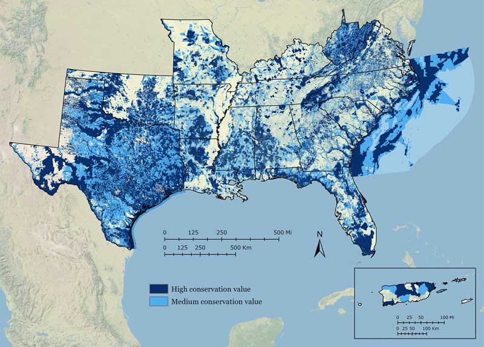

> The SECAS goal: a 10% or greater improvement in the health, function, and connectivity of southeastern ecosystems by 2060.

<figure>
  
  <figcaption>Conservation professionals review a draft of the Conservation Blueprint in the South Atlantic subregion.</figcaption>
</figure>

The Southeast Conservation Blueprint is more than just a map. It’s a living, spatial plan that identifies important areas for conservation and restoration across the Southeast and Caribbean. Just as a construction blueprint serves as a plan for achieving an architect’s design for a building, the Conservation Blueprint serves as a plan for achieving the SECAS goal. More than 130 people from over 50 organizations have used or are using the Blueprint in their work. In the South Atlantic subregion alone, the Blueprint has helped inform more than \$20 million in conservation funding &mdash; 99% of which has supported on-the-ground conservation action.

By providing regional context for local decisions, the Blueprint helps organizations with different goals find common ground &mdash; opportunities to align their efforts to protect fish and wildlife habitat, improve quality of life for people, safeguard life and property, and develop strong economies. As the Blueprint guides decisions and brings in new resources to benefit our communities, our livelihoods, and our natural and cultural heritage, it is shaping a more sustainable future for our region.

More than 1,700 people from 500 different organizations have actively participated in developing the Southeast Blueprint so far. The Blueprint stitches together smaller subregional plans into one consistent map, incorporating the best available information about the current condition of key species and habitats, as well as future threats. Because the Blueprint is a living plan, it will evolve over time, driven by improvements to the underlying science, our growing understanding of on-the-ground conditions, and input from new partners.

## Blueprint Version 3.0

  <a href="https://seregion.databasin.org/galleries/0c3e76a996e84608890875a5aa27e4a3" target="_blank" title="Explore the data">Explore the data</a>

  <a href="https://www.sciencebase.gov/catalog/file/get/5c587376e4b0708288ff27cb?name=SE_Blueprint_v3_0_DataDownload.zip" target="_blank" title="Explore the data">Download the data</a>

Southeast Blueprint 3.0 was first presented in October 2018 during the annual meeting of the Southeastern Association of Fish and Wildlife Agencies, and finalized in February 2019. Significant improvements over the previous versions include: full coverage of Texas, integrated threat layers covering the full Southeast, and the addition of a hubs and corridors layer covering most of the region. You can [explore and download the data on the Southeast Conservation Planning Atlas](https://seregion.databasin.org/galleries/0c3e76a996e84608890875a5aa27e4a3) (CPA), a free online mapping platform. There, you can also read more about the methods and underlying datasets used to create Version 3.0, and check out [a user guide](https://www.sciencebase.gov/catalog/file/get/5c81380ce4b0938824476207?name=SoutheastBlueprintUserGuide.pdf) full of ideas about how to apply it to your own work.

<figure>
  
  <figcaption><a href="https://seregion.databasin.org/galleries/0c3e76a996e84608890875a5aa27e4a3">Southeast Blueprint Version 3.0</a> identifies high value areas for conservation and restoration across the Southeast and Caribbean.</figcaption>
</figure>

### Blueprint categories

**High conservation value:** These areas are the most important for ecosystem health, function, and connectivity.  
**Medium conservation value:** This category captures areas that might require more restoration, but are important for buffering high value areas and maintaining connectivity.

### A few things to keep in mind as you explore the Blueprint

- The Blueprint identifies lands and waters that have high conservation value. A range of conservation activities could benefit those priority areas, including management, economic incentives, and protection. The Blueprint should not be interpreted as a plan for land acquisition.
- The Blueprint is not intended to be used in isolation of other datasets. Instead, it provides a regional perspective that, in combination with local data and knowledge, can help inform decisions about where to focus conservation action in the face of future change.
- If you want to find your piece of the Blueprint, depending on where you’re looking, you can explore the subregional Blueprint inputs and underlying datasets. These underlying layers can help you understand the important areas for birds, water quality, climate resilience, prescribed burning, reforestation, and much more. These other layers can help you tell the unique story of what makes your area of interest special. Contact Blueprint staff if you’d like some help.
- As a living spatial plan, the Blueprint is always a work in progress. We maintain a list of the problems with the Blueprint that have been identified in the review process so far. Those “known issues” are captured [in the Blueprint documentation on the Conservation Planning Atlas](https://seregion.databasin.org/galleries/0c3e76a996e84608890875a5aa27e4a3). The Blueprint will continue to be refined to incorporate updates to the input layers and feedback from Blueprint users and other partners.

### Input data

Version 3.0 of the Southeast Blueprint integrates the following plans:

- The Peninsular Florida Blueprint 1.2: [Learn more and access the data on the Peninsular Florida CPA](https://pflcc.databasin.org/datasets/a0e28e5df3e14fd2b586adb219f12e88)
- The South Atlantic Conservation Blueprint 2.2: [Learn more about the South Atlantic Blueprint](http://www.southatlanticlcc.org/blueprint/) and [access the data on the South Atlantic CPA](https://salcc.databasin.org/datasets/c04c8229467f49e88f8774346a17052a)
- The North Atlantic Nature’s Network Conservation Design: [Learn more about Nature’s Network](http://naturesnetwork.org/) and [access the data on the Northeast CPA](https://nalcc.databasin.org/datasets/3d670fad4c924e7ba2ae02f04a128256)
- The Appalachian NatureScape Design (Phase II): [Learn more about NatureScape](http://applcc.org/plan-design/conservation-design) and [access the data on the Appalachian CPA](https://applcc.databasin.org/datasets/22cda640930c4692a9dc1413b201ccc1) (note: the Phase II NatureScape Design was combined with [Phase I species richness](https://databasin.org/datasets/5d4512416b864ee88da9ed591ee7daea) to produce the final Appalachian input to the Southeast Blueprint)
- The Gulf Coastal Plains and Ozarks (GCPO) Blueprint: [Learn more about the GCPO Blueprint](https://gcpolcc.org/resource/gcpo-lcc-conservation-blueprint-10) and [access the data on the GCPO CPA](https://gcpolcc.databasin.org/galleries/878cb6e7cf234d8fafc6e9ae34d6d10f)
- The Gulf Coast Prairie (GCP) Blueprint: [Learn more and access the data on the GCP CPA](https://gcplcc.databasin.org/datasets/bcb0e17292ae452fabf03be20d30740b)
- The Gulf Hypoxia Precision Conservation Blueprint v1.5 Sum - Conservation and Watershed Interests (2016) layer: [Learn more on the LCC Network Science Catalog and access the data on DataBasin](https://lccnetwork.org/resource/mississippi-river-basingulf-hypoxia-initiative-precision-conservation-blueprint)
- The Caribbean Landscape Conservation Design: [Learn more about the process and data used to develop the Caribbean LCD](https://caribbeanlcc.databasin.org/galleries/ecb079d09f5a430fafc2d48d68bdf1b4#expand=131288) (note: full data beyond the two pilot watersheds is available on request by emailing Matt Snider at [matthew_snider@fws.gov](mailto:matthew_snider@fws.gov))
- The Crucial Habitat Assessment Tool (CHAT): [Learn more and access the data on the CHAT website](http://www.wafwachat.org/)

## Contact Blueprint staff

Do you have a question about the Blueprint? Would you like help using the Blueprint to support a proposal or inform a decision? Staff across the Southeast are here to support you! You can also explore the [_Online Guide to using the Southeast Blueprint_](https://www.sciencebase.gov/catalog/file/get/5c81380ce4b0938824476207?name=SoutheastBlueprintUserGuide.pdf), which will walk you through how to use it on your own.

The Blueprint is also revised based on input from people like you. So if you have a suggestion on how to improve the Blueprint, let us know!

To get help or provide feedback, [visit the contact page to reach out to the staff person working in your state]({{ "/contact" | prepend: site.baseurl }}).

## Who’s using the Blueprint

<figure>
  
  <figcaption>During a joint meeting of the NC Sandhills Conservation Partnership, Greater Uwharrie Conservation Partnership, and NC Longleaf Coalition, members of a connectivity breakout group use the Blueprint to identify potential corridors to connect longleaf priority areas in the Uwharries and Sandhills.</figcaption>
</figure>

Specific examples of how the Blueprint has been used include:

- A regional Council of Government used the Blueprint to help a town refine the natural habitat cores in their comprehensive plan.
- A National Wildlife Refuge Manager used the Blueprint to support a proposal for funding to help recover an endangered salamander.
- A private company used the Blueprint in a confidential analysis to support its business.
- A state wildlife agency used the Blueprint to support a proposal for funding to protect coastal wetlands and improve public access to recreation opportunities.
- Longleaf pine conservation partnerships used the Blueprint to identify restoration and management priorities.
- A nonprofit organization used the Blueprint to support a critical source of conservation funding at its state legislature.
- A National Forest used the Blueprint to inform its public lands planning.

These are just a few of almost 50 Blueprint uses completed so far, with about 60 more still in progress! For more in-depth examples of how the Blueprint is being used, check out the [SECAS in Action story map]({{ "/story-map" | prepend: site.baseurl }}).

Individuals from nearly 60 different organizations have used, or are in the process of using the Blueprint, including:

<figure class="image-right">
  
  <figcaption>Number of unique organizations using the Blueprint by sector, as of September 2018.</figcaption>
</figure>

### 8 state agencies

- Arkansas Game and Fish Commission
- North Carolina Wildlife Resource Commission
- South Carolina Department of Natural Resources
- North Carolina Natural Heritage Program
- Georgia Department of Natural Resources
- North Carolina Department of Agriculture
- Florida Fish and Wildlife Conservation Commission
- North Carolina Forest Service

### 3 local land trusts

- Coastal Land Trust
- Pee Dee Land Trust
- North American Land Trust

### 8 federal agencies

- U.S. Fish and Wildlife Service
- U.S. Forest Service
- U.S. Army Corps of Engineers
- Environmental Protection Agency
- Natural Resource Conservation Service
- National Park Service
- Department of Defense
- National Oceanic and Atmospheric Administration

### 3 local governments and planning organizations

- Catawba Council of Government
- Horry County, SC
- Fort Mill, SC

### 13 nonprofits

- National Wildlife Refuge Association
- Pew Charitable Trusts
- The Conservation Fund
- Winyah Rivers Foundation
- The Longleaf Alliance
- North Carolina Foundation for Soil and Water Conservation
- Ducks Unlimited
- The Nature Conservancy
- NatureServe
- American Rivers
- Open Space Institute
- U.S. Endowment for Forestry and Communities
- National Fish and Wildlife Foundation

### 13 conservation partnerships

- Cape Fear Arch
- Southeast Aquatic Resources Partnership
- Eastern NC/Southeastern VA Strategic Habitat Conservation Team
- South Atlantic Fishery Management Council
- Southeast Regional Partnership for Planning and Sustainability
- Flint River Partnership
- Cape Fear River Partnership
- Upper Waccamaw Task Force
- Chattahoochee Fall Line Conservation Partnership
- So-Lo ACE Longleaf Partnership
- Talladega-Mountain Longleaf Conservation Partnership
- DeSoto-Camp Shelby Local Implementation Team
- Keeping Forests as Forests

### 4 private businesses

- Darden Consulting
- Research Planning, Inc.
- Dial Cordy and Associates
- One confidential business

### 5 universities and academic organizations

- University of Florida
- University of Georgia
- North Carolina State University
- Clemson University
- Tall Timbers Research Station

## The history of the Blueprint

<figure>
  
  <figcaption>Ed Carter, Executive Director of the Tennessee Wildlife Resources Agency, speaks about the history and importance of SECAS alongside Cindy Dohner, Southeast Regional Director of the U.S. Fish and Wildlife Service. This SECAS symposium took place at the 2016 SEAFWA annual meeting.</figcaption>
</figure>

In the fall of 2013, SECAS leadership set a goal of developing a first generation Southeast Blueprint for landscape-scale conservation by the fall of 2016. Many different conservation planning efforts were already underway, but most eco-regional plans only covered parts of states, while state-specific plans stopped at the state line. The results of all this parallel planning did not yet add up to an integrated regional strategy.

Three years later, Version 1.0 of the Southeast Blueprint was released in December 2016. Development of this first Blueprint relied heavily on Landscape Conservation Cooperative (LCC) partnerships across the Southeast and Caribbean. This plan provided the first ever integration of spatial plans developed through the South Atlantic, Appalachian, Gulf Coastal Plains and Ozarks, Gulf Coast Prairie, North Atlantic, and Caribbean LCCs.

Version 2.0 of the Southeast Blueprint was released in November 2017. This plan incorporated the improved subregional Blueprints from several LCCs and established priority connections with western states through the Crucial Habitat Assessment Tool. Significant improvements over Version 1.0 included improved consistency across LCC boundaries, improved consistency in climate change response, and improved integration beyond the Southeast.

Version 3.0 of the Southeast Blueprint was first introduced at the October 2018 SEAFWA annual meeting, and officially released in February 2019. Its development occurred during a time of transition for the LCC Network where the structure and function of some LCCs was changing. Despite these changes, the capacity and commitment to continue to support Blueprint users and improve the Southeast Blueprint remains strong, evidenced by the many examples of Blueprint implementation, as well as recent progress on spatial coverage, connectivity, and threats.

The next version of the Southeast Blueprint is expected in Fall 2019. It will continue the ongoing evolution toward better integration across the various Blueprint inputs and regular updates based on the best available information.
