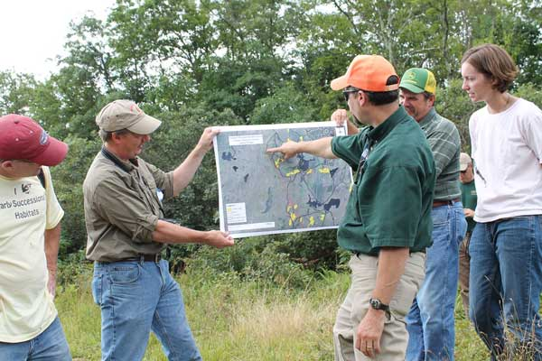

<figure class="image-right">
  
  <figcaption>SECAS is helping to better coordinate planning, management, and conservation actions throughout the Southeast. Photo by Brian Smith.</figcaption>
</figure>

**Using the Blueprint:** Staff across the Southeast are available to answer questions and help you use the Blueprint to support a proposal or inform a decision. Your experience using the Blueprint will also guide future improvements and ensure it matches on-the-ground conditions.

**Improving the Blueprint data and methods:** If you’re more of a data person, and you’d like to help improve the Blueprint inputs and methods, we welcome your feedback! We’re always looking for ways to make the next version better.

To get help or provide feedback, reach out to the staff person working in your state:

- VA - [Scott Schwenk](mailto:william_schwenk@fws.gov), (413) 253-8647
- NC - [Hilary Morris](mailto:hilary_morris@fws.gov), (919) 707-0252
- SC - [Hilary Morris](mailto:hilary_morris@fws.gov), (919) 707-0252
- GA - [Hilary Morris](mailto:hilary_morris@fws.gov), (919) 707-0252
- FL - [Beth Stys](mailto:beth.stys@myfwc.com), (850) 404-6113
- KY - [Hilary Morris](mailto:hilary_morris@fws.gov), (919) 707-0252
- WV - [Scott Schwenk](mailto:william_schwenk@fws.gov), (413) 253-8647
- TN - [Hilary Morris](mailto:hilary_morris@fws.gov), (919) 707-0252
- Puerto Rico, [Brent Murry](mailto:brent_murry@fws.gov), (787) 764-7790
- AL - [Todd Jones-Farrand](mailto:david_jones-farrand@fws.gov), (573) 355-0753
- MS - [Todd Jones-Farrand](mailto:david_jones-farrand@fws.gov), (573) 355-0753
- AR - [Todd Jones-Farrand](mailto:david_jones-farrand@fws.gov), (573) 355-0753
- MO - [Todd Jones-Farrand](mailto:david_jones-farrand@fws.gov), (573) 355-0753
- LA - [Todd Jones-Farrand](mailto:david_jones-farrand@fws.gov), (573) 355-0753
- OK - [Ben Kahler](mailto:benjamin_kahler@fws.gov), (337) 266-8523
- TX - [Ben Kahler](mailto:benjamin_kahler@fws.gov), (337) 266-8523
- Southeast-wide - [Rua Mordecai](mailto:rua_mordecai@fws.gov), (919) 707-0122
