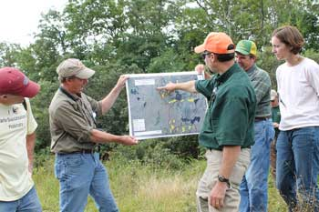

<figure class="image-right">
  
  <figcaption>SECAS is helping to better coordinate planning, management, and conservation actions throughout the Southeast. Photo by Brian Smith.</figcaption>
</figure>

Get to know your SECAS staff, and get in touch!

## Coordination
The SECAS Coordinator and Science Coordinator help keep the SECAS partnership and its products on track.

**Mallory Martin, Coordinator**
Mallory is based in Raleigh, NC. He helps set the overall strategic direction for SECAS and clear barriers to landscape-scale collaboration across the Southeast and Caribbean. He works closely with the SECAS Executive Steering Committee and the leadership of the Southeastern Association of Fish and Wildlife Agencies (SEAFWA) and Southeast Natural Resource Leaders Group (SENRLG). Contact Mallory at mallory_martin@fws.gov.  

**Rua Mordecai, Science Coordinator**
Rua is based on Raleigh, NC. He coordinates the Southeast Conservation Blueprint and takes the lead on tracking progress toward the SECAS goal. He works closely with the SECAS Points of Contact, as well as all the staff and partners working on the Southeast Blueprint. Contact Rua at rua_mordecai@fws.gov.<br 

## Blueprint User Support

Blueprint user support staff are here to help you use the Blueprint to support a proposal or inform a decision. They can answer questions, make maps and write narratives to strengthen grant applications, assist with conservation planning, and much more. They also help incorporate your feedback into future Blueprint revisions. Not sure who to contact? Start with Hilary at hilary_morris@fws.gov, and she'll put you in touch with the best person to help.

**Hilary Morris, Blueprint User Support & SECAS Communications Lead**
Hilary is based in Raleigh, NC. She coordinates communications for SECAS, which involves everything from managing the website and newsletter to writing understandable explanations of indicator data in the Blueprint. On the user support side, she has experience helping with strengthening grant applications, public lands planning, conservation partnerships, and city/county planning. She works primarily with Blueprint users in NC, SC and VA. Contact Hilary at hilary_morris@fws.gov.  

**Louise Vaughn, Blueprint User Support**
Louise is based on Raleigh, NC. She has experience helping with conservation partnerships, public lands planning, strengthening grant applications, and city/county planning. She works primarily with Blueprint users in NC, SC and VA. Contact Louise at louise_vaughn@fws.gov.  <br 

**Emily Granstaff, Blueprint User Support**
Emily is based in Cookeville, TN. She has experience helping with xx, xx, xx, and xx. She works primarily with Blueprint users in xx, xx, xx, and xx. Contact Emily at emily_granstaff@fws.gov.  

**Chris DeVore, Blueprint User Support**
Chris is based on Cookeville, TN. She has experience hjelping with xx, xx, xx, and xx. He works primarily with Blueprint users in xx, xx, xx, and xx. Contact Chris at christopher_DeVore@fws.gov.  

**Alex Lamle, Blueprint User Support**
Alex is based in Atlanta, GA. She has experience helping with xx, xx, xx, and xx. She works primarily with Blueprint users in xx, xx, xx, and xx. Contact Alex at alexandria_lamle@fws.gov.  

## Blueprint GIS Support

**Amy Keister, Blueprint GIS Support**
Amy is based in Raleigh, NC. She takes the lead on the underlying spatial data and modeling for the Southeast Blueprint. Contact Amy at amy_keister@fws.gov.  

**Daniel Adams, Blueprint GIS Support**
Daniel is based on Cookeville, TN. He works on developing and improving data for the Southeast Blueprint, and helps with more technical GIS aspects of user support. Contact Daniel at daniel_adams@fws.gov  

**Blair Tirpak, Blueprint GIS Support**
Blair is based in Lafayette, LA. She works on developing and improving data for the Southeast Blueprint, and helps with more technical GIS aspects of user support. Contact Blair at blair_tirpak@fws.gov.  
