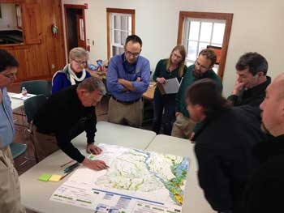

## Why you should join the Southeast Conservation Adaptation Strategy

<figure class="image-right">
  
  <figcaption>SECAS is helping to better coordinate planning, management, and conservation actions throughout the Southeast. Photo by Brian Smith.</figcaption>
</figure>

**Conservation Organizations, Natural Resource Agencies, and Regulatory Bodies** – Through greater collaboration and identification of shared priorities, this community can share data, compete more effectively for funding, and better envision and work towards a desired landscape of the future. This desired landscape sustains fish and wildlife populations, cultural resources, and ecosystem services like drinking water and recreational opportunities that provide essential benefits to society.

**City and Regional Planners** – Increasingly, the public desires green spaces, smart growth, and wild places within or near their communities. Municipalities can utilize SECAS and with planners identify key landscapes, waterscapes, and corridors that should be preserved to conserve cultural and natural resources, protect communities from storm damage or flooding, and provide recreational opportunities – which all contribute to a greater quality of life for individuals and communities.

**Local, State, and National Government** – Because they cross political boundaries, regional partnerships are uniquely positioned to tackle some of the greatest conservation challenges facing society. Collaboration within such partnerships allows for the cost-effective use of tax-payer dollars -- by pooling together resources and leveraging funds among partners -- as well as eliminates redundancies among programs and organizations. The Southeast Conservation Adaptation Strategy can also elevate local and state priorities to a regional level, bringing additional resources to build on existing efforts.

**Private Landowners** – Engagement in SECAS can help landowners identify opportunities for voluntary partnerships with state and federal agencies, non-profit conservation groups, and business and industry with a common interest in sustaining private lands and keeping working lands productive. These proactive partnerships can reduce land and water resource conflicts as well as regulatory solutions for imperiled species.

**Business & Industry** – Engagement in SECAS can help businesses and industry improve their efficiency in accessing data that can inform their decision making that affect fish and wildlife resources.  Access to data coupled with linkages to state and federal agencies, private landowners, and non-profit conservation groups can be used to proactively work on areas of common interest that not only help advance business ventures but also help achieve the landscape of the future needed to sustain fish and wildlife populations.  Information is key and SECAS can help with that.

## How to Apply the Blueprint to Your Work?

<figure class="image-right">
  
  <figcaption>Conservationists identify high priority areas at a GCPO LCC blueprint workshop in Caddo Lake, TX. Photo: Gregg Elliott.</figcaption>
</figure>

Whether you’re a city planner, an industry representative, or a natural resource professional, the SECAS Blueprint can provide individuals and organizations with regional context for local decisions. It can also help find common ground with others in aligning efforts to protect fish and wildlife habitat, improve quality of life for people, and develop strong economies. Examples of questions the SECAS Blueprint can help to answer include:

 - Where are the best places for smart urban growth that minimize negative impacts to fish and wildlife and provide greater access to open space or community protection?
 - How do proposed new public lands fit into a connected network of lands and waters across the region?
 - Where would stream restoration provide the most benefits to fish, drinking water quality, and outdoor recreation?
 - Where should we focus conservation efforts now to improve the resilience of ecosystems and communities in advance of major disasters like hurricanes and oil spills?
 - Where will economic incentives achieve the most conservation benefits on working lands?

## Get Engaged!

Everyone can get involved in the Vision of SECAS, where partners are working together to design and achieve a connected network of landscapes and seascapes that supports thriving fish and wildlife populations and improved quality of life for people across the southeastern United States and the Caribbean.

Individuals and organizations can actively participate in the Blueprint or Conservation Design development process taking place within individual Landscape Conservation Cooperatives (LCCs) by attending workshops, commenting on drafts, reviewing indicator resources and species, and contacting LCC staff to initiate conversations or to share expertise and knowledge.

The most efficient opportunity for engagement is through one or more of the following partnerships:

- [Appalachian LCC](http://applcc.org/request_login_pre)
- [Caribbean LCC](http://caribbeanlcc.org/)
- [Gulf Coast Prairie LCC](http://eepurl.com/bcPF61)
- [Gulf Coastal Plains and Ozarks LCC](http://gcpolcc.org/main/authorization/signUp?)
- [Peninsular Florida LCC](http://eepurl.com/Yejaf)
- [South Atlantic LCC](http://www.southatlanticlcc.org/register/)
- [Southeast Aquatics Resources Partnership](http://visitor.r20.constantcontact.com/d.jsp?llr=dwi5jvcab&p=oi&m=1102374183619&sit=oz6u7fzdb&f=bb09243d-ac3a-499c-ae90-b14c9d943152)

Individuals may also be inclined to contact the most relevant State or Federal agency that they work with and that are also engaged in SECAS.  See the [partners page](http://secassoutheast.org/partners) for those agencies already involved in SECAS.
