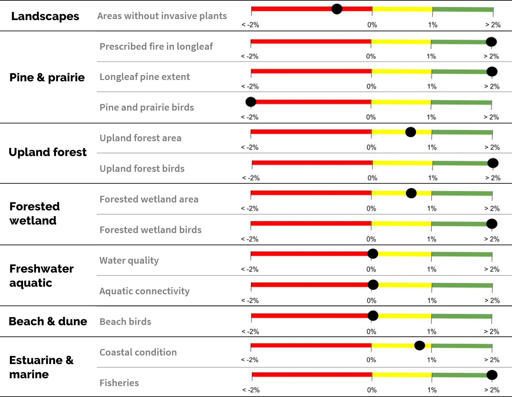

<blockquote>A 10% or greater improvement in the health, function, and connectivity of Southeastern ecosystems by 2060  
Near-term metrics: 
<ul><li>1% improvement in the health, function, and connectivity of Southeastern ecosystems every 4 years</li>
<li>1% increase in conservation actions within the Southeast Conservation Blueprint every 4 years</li></ul>
</blockquote>

To read more, <a href="../pdf/SECAS-goal-1-pager.pdf">view this 1-pager on the SECAS goal</a>.

## Progress toward achieving the goal

  <a href="../pdf/SECAS-goal-report-2020.pdf" target="_blank" title="Read the 2020 progress report">Read the 2020 progress report</a>

 
 
 
 

<a href="../pdf/SECAS-goal-report-2020.pdf">The 2020 progress report, *Recent trends in Southeastern ecosystems*</a>, is based on the most recent 3-6 years of available data from existing Southeast-wide monitoring programs. Here's a snapshot from the report showing whether each indicator is on track for 1% or greater improvement every four years:

<figure>
  
  <figcaption>Estimated percent change in indicator over 4 years based on most recently available data.</figcaption>
</figure>

## Intended uses for goal

- **Provide a simple description of what SECAS is trying to do:** This will complement the broad SECAS vision of designing and achieving a connected network of lands and waters that supports thriving fish and wildlife populations and improved quality of life for people.
- **Attract additional sources of conservation funding to the Southeast:** A shared goal and measurement system can help communicate the need for additional funding.
- **Identify new opportunities for collaboration around shared interests:** A shared goal and understanding of Southeastern ecosystem condition can help reveal new ways to work together that may not be obvious when looking at species and ecosystems in isolation.
- **Improve connections with “non-traditional” partners:** A shared goal can help improve communication with private landowners, urban planners, forestry/agricultural interests, the Department of Defense, and other organizations shaping the lands and waters of the Southeast.

## Basis for goal numbers

The long-term goal is intended to be both ambitious and achievable. It is based on a synthesis of 12 regional and subregional ecosystem assessments covering the Southeast (e.g., Everglades Report Card, State of the South Atlantic, Chesapeake Bay Report Card, State of the Birds, etc.). The near-term goals identify minimum progress needed to stay on track with meeting the long-term goal.
