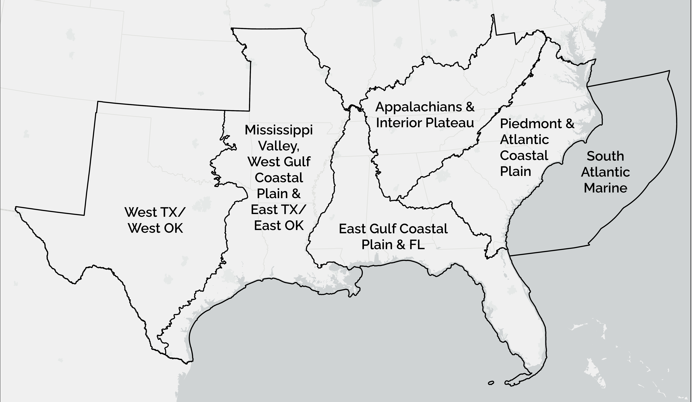
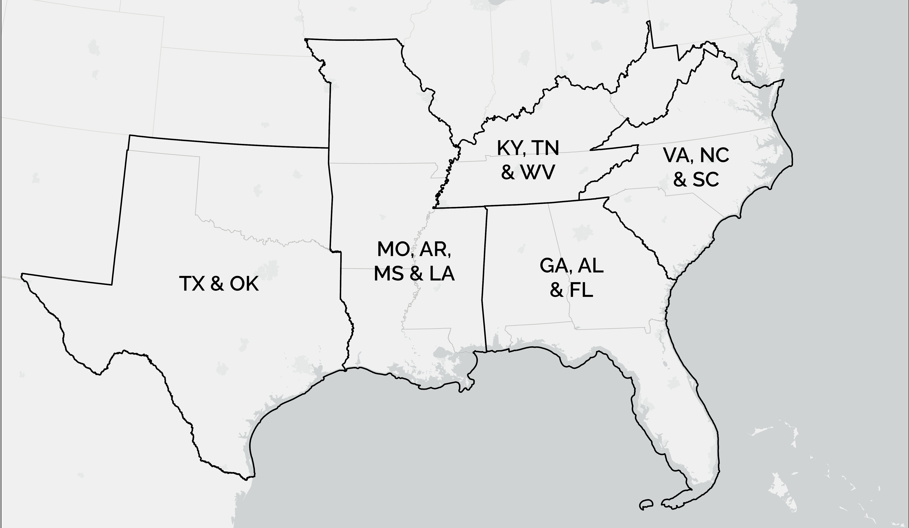

The Southeast Conservation Adaptation Strategy (SECAS) is a regional conservation initiative that spans the Southeastern United States and Caribbean. The primary product of SECAS is the Southeast Conservation Blueprint, a living, spatial plan that identifies important places for conservation and restoration across the Southeast and Caribbean. We regularly update the Blueprint based on new data and feedback from the conservation community, and this year, the Blueprint is undergoing a major revision. <b>We need your feedback on the draft Blueprint!</b> Your input helps to ensure the Blueprint represents on-the-ground conditions and your conservation priorities, and helps staff prioritize future improvements.

In May, we are hosting a series of 1.5-hour workshops via Zoom to review the draft Blueprint across different state groupings and subregions across the Southeast. Please note, some workshops are repeated to account for scheduling conflicts--_please only register for one workshop for a given area (the content will be the same in both)_.

<ul>
  <li>For more information about what changes you can expect to see with the 2022 update to the Southeast Blueprint, take a look at <a href="https://secassoutheast.org/2021/07/30/Progress-toward-a-more-consistent-Southeast-Blueprint-in-2022.html">this blog by SECAS Science Coordinator, Rua Mordecai</a>.</li>
  <li>Would you like more information about the history of the Blueprint and how it is developed? <a href="http://secassoutheast.org/blueprint">Explore the Blueprint page of the SECAS website</a> or reach out to <a href="http://secassoutheast.org/staff>Blueprint User Support staff in your area</a>.</li>
  <li>Have questions about the workshops? Contact <a href="mailto:hilary_morris@fws.gov">hilary_morris@fws.gov</a>.</li>
  <li>Unable to attend any of the scheduled workshops? There will be an alternative way to provide feedback once the draft Blueprint is available online by the end of April. Stay tuned for more information, or reach out to one of <a href="http://secassoutheast.org/staff">our Blueprint User Support staff</a>in the meantime.</li>
  </ul>
  

<h2>Register for a workshop</h2>

<table style="border-width: 1px; border-style: solid; border-color: #000000; padding:7px>
  <tr>
    <th style="border-width: 1px; border-style: solid; border-color: #000000; padding:7px>Date</th>
    <th style="border-width: 1px; border-style: solid; border-color: #000000; padding:7px>Time</th>
    <th style="border-width: 1px; border-style: solid; border-color: #000000; padding:7px>Subgeography</th>
    <th style="border-width: 1px; border-style: solid; border-color: #000000; padding:7px>Registration link</th>
  </tr>
   <tr>
     <td style="border-width: 1px; border-style: solid; border-color: #000000; padding:7px>May 3</td>
     <td style="border-width: 1px; border-style: solid; border-color: #000000; padding:7px>10 am ET</td>
     <td style="border-width: 1px; border-style: solid; border-color: #000000; padding:7px>VA, NC & SC</td>
     <td style="border-width: 1px; border-style: solid; border-color: #000000; padding:7px>[Insert link here]</td>
  </tr>
   <tr>
     <td style="border-width: 1px; border-style: solid; border-color: #000000; padding:7px>May 4</td>
     <td style="border-width: 1px; border-style: solid; border-color: #000000; padding:7px>10 am ET</td>
     <td style="border-width: 1px; border-style: solid; border-color: #000000; padding:7px>GA, AL & FL</td>
     <td style="border-width: 1px; border-style: solid; border-color: #000000; padding:7px>[Insert link here]</td>
  </tr>
   <tr>
     <td style="border-width: 1px; border-style: solid; border-color: #000000; padding:7px>May 4</td>
     <td style="border-width: 1px; border-style: solid; border-color: #000000; padding:7px>2 pm ET</td>
     <td style="border-width: 1px; border-style: solid; border-color: #000000; padding:7px>West TX/West OK</td>
     <td style="border-width: 1px; border-style: solid; border-color: #000000; padding:7px>[Insert link here]</td>
  </tr>
   <tr>
     <td style="border-width: 1px; border-style: solid; border-color: #000000; padding:7px>May 5</td>
     <td style="border-width: 1px; border-style: solid; border-color: #000000; padding:7px>10 am ET</td>
     <td style="border-width: 1px; border-style: solid; border-color: #000000; padding:7px>KY, TN & WV</td>
     <td style="border-width: 1px; border-style: solid; border-color: #000000; padding:7px>[Insert link here]</td>
  </tr>
   <tr>
     <td style="border-width: 1px; border-style: solid; border-color: #000000; padding:7px>May 5</td>
     <td style="border-width: 1px; border-style: solid; border-color: #000000; padding:7px>1 pm ET</td>
     <td style="border-width: 1px; border-style: solid; border-color: #000000; padding:7px>South Atlantic Marine</td>
     <td style="border-width: 1px; border-style: solid; border-color: #000000; padding:7px>[Insert link here]</td>
  </tr>
    <tr>
     <td style="border-width: 1px; border-style: solid; border-color: #000000; padding:7px>May 9</td>
     <td style="border-width: 1px; border-style: solid; border-color: #000000; padding:7px>1 pm ET</td>
     <td style="border-width: 1px; border-style: solid; border-color: #000000; padding:7px>VA, NC & SC</td>
     <td style="border-width: 1px; border-style: solid; border-color: #000000; padding:7px>[Insert link here]</td>
  </tr>
   <tr>
     <td style="border-width: 1px; border-style: solid; border-color: #000000; padding:7px>May 10</td>
     <td style="border-width: 1px; border-style: solid; border-color: #000000; padding:7px>10 am ET</td>
     <td style="border-width: 1px; border-style: solid; border-color: #000000; padding:7px>South Atlantic Marine</td>
     <td style="border-width: 1px; border-style: solid; border-color: #000000; padding:7px>[Insert link here]</td>
  </tr>
    <tr>
     <td style="border-width: 1px; border-style: solid; border-color: #000000; padding:7px>May 10</td>
     <td style="border-width: 1px; border-style: solid; border-color: #000000; padding:7px>2 pm ET</td>
     <td style="border-width: 1px; border-style: solid; border-color: #000000; padding:7px>KY, TN & WV</td>
     <td style="border-width: 1px; border-style: solid; border-color: #000000; padding:7px>[Insert link here]</td>
  </tr>
      <tr>
     <td style="border-width: 1px; border-style: solid; border-color: #000000; padding:7px>May 11</td>
     <td style="border-width: 1px; border-style: solid; border-color: #000000; padding:7px>10 am ET</td>
     <td style="border-width: 1px; border-style: solid; border-color: #000000; padding:7px>MO, AR, MS & LA</td>
     <td style="border-width: 1px; border-style: solid; border-color: #000000; padding:7px>[Insert link here]</td>
  </tr>
   <tr>
     <td style="border-width: 1px; border-style: solid; border-color: #000000; padding:7px>May 11</td>
     <td style="border-width: 1px; border-style: solid; border-color: #000000; padding:7px>1 pm ET</td>
     <td style="border-width: 1px; border-style: solid; border-color: #000000; padding:7px>Piedmont & Atlantic Coastal Plain</td>
     <td style="border-width: 1px; border-style: solid; border-color: #000000; padding:7px>[Insert link here]</td>
  </tr>
   <tr>
     <td style="border-width: 1px; border-style: solid; border-color: #000000; padding:7px>May 12</td>
     <td style="border-width: 1px; border-style: solid; border-color: #000000; padding:7px>1 pm ET</td>
     <td style="border-width: 1px; border-style: solid; border-color: #000000; padding:7px>GA, AL & FL</td>
     <td style="border-width: 1px; border-style: solid; border-color: #000000; padding:7px>[Insert link here]</td>
  </tr>
   <tr>
     <td style="border-width: 1px; border-style: solid; border-color: #000000; padding:7px>May 16</td>
     <td style="border-width: 1px; border-style: solid; border-color: #000000; padding:7px>2 pm ET</td>
     <td style="border-width: 1px; border-style: solid; border-color: #000000; padding:7px>MO, AR, MS & LA</td>
     <td style="border-width: 1px; border-style: solid; border-color: #000000; padding:7px>[Insert link here]</td>
  </tr>
    <tr>
     <td style="border-width: 1px; border-style: solid; border-color: #000000; padding:7px>May 17</td>
     <td style="border-width: 1px; border-style: solid; border-color: #000000; padding:7px>11 am ET</td>
     <td style="border-width: 1px; border-style: solid; border-color: #000000; padding:7px>TX & OK</td>
     <td style="border-width: 1px; border-style: solid; border-color: #000000; padding:7px>[Insert link here]</td>
  </tr>
  <tr>
     <td style="border-width: 1px; border-style: solid; border-color: #000000; padding:7px>May 17</td>
     <td style="border-width: 1px; border-style: solid; border-color: #000000; padding:7px>2 pm ET</td>
     <td style="border-width: 1px; border-style: solid; border-color: #000000; padding:7px>East Gulf Coastal Plain & FL</td>
     <td style="border-width: 1px; border-style: solid; border-color: #000000; padding:7px>[Insert link here]</td>
  </tr>
    <tr>
     <td style="border-width: 1px; border-style: solid; border-color: #000000; padding:7px>May 18</td>
     <td style="border-width: 1px; border-style: solid; border-color: #000000; padding:7px>10 am ET</td>
     <td style="border-width: 1px; border-style: solid; border-color: #000000; padding:7px>Appalachians & Interior Plateau</td>
     <td style="border-width: 1px; border-style: solid; border-color: #000000; padding:7px>[Insert link here]</td>
  </tr>
   <tr>
     <td style="border-width: 1px; border-style: solid; border-color: #000000; padding:7px>May 19</td>
     <td style="border-width: 1px; border-style: solid; border-color: #000000; padding:7px>10 am ET</td>
     <td style="border-width: 1px; border-style: solid; border-color: #000000; padding:7px>Mississippi Valley, West Gulf Coastal Plain & East TX/East OK</td>
     <td style="border-width: 1px; border-style: solid; border-color: #000000; padding:7px>[Insert link here]</td>
  </tr>
 </table>
 _Note: All times are shown in Eastern Time. Please adjust accordingly for your time zone._
   
<figure>
  
  <figcaption>Subregional workshops will focus on reviewing the Blueprint in these areas.</figcaption>
</figure>

<figure>
  
  <figcaption>State workshops will focus on reviewing the Blueprint in these areas.</figcaption>
</figure>
