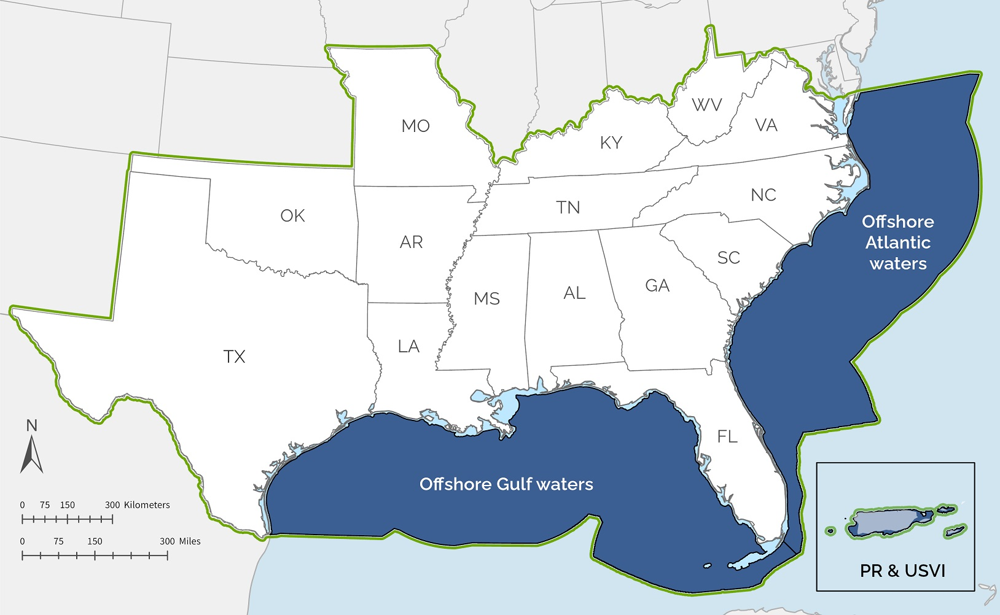
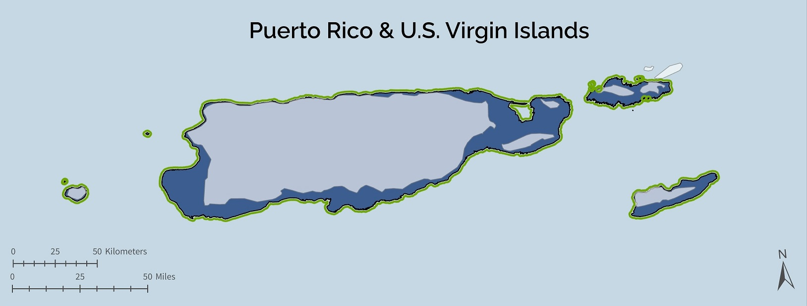

<blockquote>Workshops have wrapped up for Southeast Blueprint 2023! This page will be updated in the future for the next workshop series.</blockquote>

The Southeast Conservation Adaptation Strategy (SECAS) is a regional conservation initiative that spans the Southeastern United States and Caribbean. The primary product of SECAS is the Southeast Conservation Blueprint, a living, spatial plan that identifies priority areas for a connected network of lands and waters across the region. We regularly update the Blueprint based on new data and feedback from the conservation community. In 2024, the Blueprint update focuses on the continental Southeast geography. It uses refined prioritization methods and incorporates a number of new and improved indicators for inland and marine areas. <b>We need your feedback on the final Blueprint!</b> Your input helps to ensure the Blueprint represents on-the-ground conditions and captures your conservation priorities. It also helps staff prioritize future improvements.

In October and November, we are hosting a series of 1.5-hour workshops via Zoom to review Blueprint 2024. Based on feedback from past attendees, we’ve changed the timing of workshops this year, so you’ll be reviewing the final version of instead of a draft. You will be able to zoom in on areas that you know and provide spatially explicit feedback on the draft Blueprint, capturing places that are underprioritized, overprioritized, and that you have questions about. Please note, some workshops are repeated to account for scheduling conflicts--_please only register for one workshop for a given area (the content will be the same in both)_. But if you want to attend workshops for different areas, feel free to register for more than one! Click on a registration link in the table below to sign up to attend.

<ul>
  <li>For more information about what changes you can expect to see with the 2024 update to the Southeast Blueprint, <a href="https://secassoutheast.org/2024/03/26/The-plan-for-the-2024-Southeast-Conservation-Blueprint.html">take a look at this blog</a> by SECAS Science Coordinator, Rua Mordecai.</li>
  <li>To learn about the new approach for balancing priorities across subregions in Blueprint 2024, <a href="https://secassoutheast.org/2024/06/26/Balancing-priorities-across-subregions-in-Blueprint-2024.html">read this blog</a> by Blueprint User Support and Communications Specialist, Hilary Morris.</li>
  <li>Curious why SECAS staff changed the timing of workshops this year to review the final Blueprint instead of a draft? <a href="https://secassoutheast.org/2024/07/15/save-the-date-for-Blueprint-2024-virtual-workshops-in-Oct-Nov.html">Another of Hilary's blogs</a> explains the reasoning.</li>
  <li>Would you like more information about the history of the Blueprint and how it is developed? <a href="http://secassoutheast.org/blueprint">Explore the Blueprint page of the SECAS website</a> or reach out to <a href="http://secassoutheast.org/staff">Blueprint User Support staff in your area</a>.</li>
  <li>Have questions about the workshops? Contact <a href="mailto:hilary_morris@fws.gov">hilary_morris@fws.gov</a>.</li>
  <li>Unable to attend any of the scheduled workshops? There will be an alternative way to provide feedback, so stay tuned for more information, or reach out to one of <a href="http://secassoutheast.org/staff">our Blueprint User Support staff</a> in the meantime.</li>
  </ul>

<h2>Register for a workshop</h2>

<table border="1" table cellpadding="7">
  <tr>
    <th>Date</th>
    <th>Time</th>
    <th>Subgeography</th>
    <th>Registration link</th>
  </tr>
   <tr>
     <td>October 22</td>
     <td>10 am ET</td>
     <td>SC, GA & FL</td>
     <td><a href="https://doitalent.zoomgov.com/meeting/register/vJIsdemupzMsEu0Xys7l4GYQptNrktmVaMg">Register via Zoom</a></td>
  </tr>
   <tr>
     <td>October 23</td>
     <td>10 am ET</td>
     <td>TX & OK</td>
     <td><a href="https://doitalent.zoomgov.com/meeting/register/vJItf-irpjwpGCysqxKpbmzZ6_1Ec9Smvls">Register via Zoom</a></td>
  </tr>
   <tr>
     <td>October 24</td>
     <td>10 am ET</td>
     <td>MO, AR & LA</td>
     <td><a href="https://doitalent.zoomgov.com/meeting/register/vJItdeioqDktHS7rHGIAVSq_2CaCytGUB0M">Register via Zoom</a></td>
  </tr>
   <tr>
     <td>October 25</td>
     <td>10 am ET</td>
     <td>U.S. Caribbean: PR & USVI</td>
     <td><a href="https://doitalent.zoomgov.com/meeting/register/vJItd-uvrz0qHKapViVB3enilYaoRgwrCaM">Register via Zoom</a></td>
  </tr>
   <tr>
     <td>October 28</td>
     <td>10 am ET</td>
     <td>Gulf coast and marine: FL, MS, AL, LA & TX</td>
     <td><a href="https://doitalent.zoomgov.com/meeting/register/vJIsceuqqz0sHBsR19F83LLxKR3ULb_MEG4">Register via Zoom</a></td>
  </tr>
    <tr>
     <td>October 29</td>
     <td>10 am ET</td>
     <td>U.S. Caribbean: PR & USVI</td>
     <td><a href="https://doitalent.zoomgov.com/meeting/register/vJIsdu2vpz4pGwemCag77os7vODrAmv88cs">Register via Zoom</a></td>
  </tr>
   <tr>
     <td>October 30</td>
     <td>10 am ET</td>
     <td>TN & NC</td>
     <td><a href="https://doitalent.zoomgov.com/meeting/register/vJIsd-2uqzgjGPjQWJ4z5ayh887nj984LMg">Register via Zoom</a></td>
  </tr>
    <tr>
     <td>October 31</td>
     <td>10 am ET</td>
     <td>Continental Southeast: All Southeast states + Atlantic & Gulf marine</td>
     <td><a href="https://doitalent.zoomgov.com/meeting/register/vJItcu6orjMoGwCQuwZY7MfbH7owGb-CaPI">Register via Zoom</a></td>
  </tr>
      <tr>
     <td>November 1</td>
     <td>10 am ET</td>
     <td>WV, VA & KY</td>
     <td><a href="https://doitalent.zoomgov.com/meeting/register/vJItcu2opjorEj3tUYXJQMMrt52hOHDBz5s">Register via Zoom</a></td>
  </tr>
      <tr>
     <td>November 4</td>
     <td>2 pm ET</td>
     <td>MO, AR & OK</td>
     <td><a href="https://doitalent.zoomgov.com/meeting/register/vJItd-CorT4uGhcRb3IqQk1SLxtfpRxF10s">Register via Zoom</a></td>
  </tr>
      <tr>
     <td>November 5</td>
     <td>2 pm ET</td>
     <td>WV, TN & KY</td>
     <td><a href="https://doitalent.zoomgov.com/meeting/register/vJItcuigpz0vHXxPXqOeLg8oMHIZhevrAB4">Register via Zoom</a></td>
  </tr>
      <tr>
     <td>November 6</td>
     <td>2 pm ET</td>
     <td>AL & MS</td>
     <td><a href="https://doitalent.zoomgov.com/meeting/register/vJIsf--oqz8sGAVUznHvom4ZVWk40eu8jo0">Register via Zoom</a></td>
  </tr>
      <tr>
     <td>November 7</td>
     <td>2 pm ET</td>
     <td>Atlantic coast and marine: VA, NC, SC, GA & FL</td>
     <td><a href="https://doitalent.zoomgov.com/meeting/register/vJIsduiurjsoEpe96WgfcLr5P1kZyGCxMWI">Register via Zoom</a></td>
  </tr>
 </table>
 _Note: All times are shown in Eastern Time. Please adjust accordingly for your time zone._
   
   

<figure>
  
  <figcaption>Marine workshops for the contiguous Southeast will focus on reviewing the Blueprint in these areas. Note: the Atlantic workshops begin just outside of state waters. The Gulf workshops include significant portions of Texas and Florida state waters, and tiny slivers of the state waters of Louisiana, Mississippi, and Alabama.</figcaption>
</figure>
<figure>
  
  <figcaption>The Puerto Rico and U.S. Virgin Islands workshops will focus on reviewing the Blueprint on these islands and the surrounding nearshore marine waters.</figcaption>
</figure>
