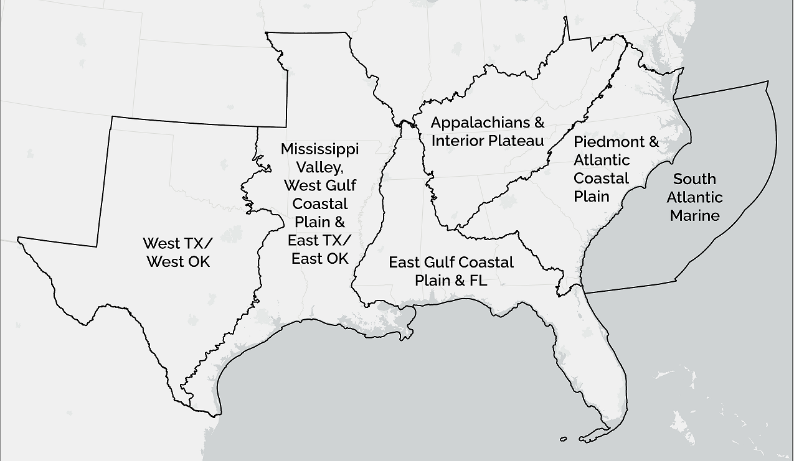
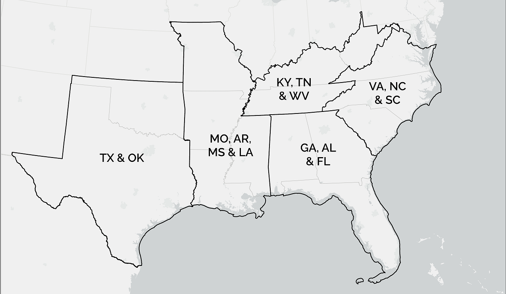

The Southeast Conservation Adaptation Strategy (SECAS) is a regional conservation initiative that spans the Southeastern United States and Caribbean. The primary product of SECAS is the Southeast Conservation Blueprint, a living, spatial plan that identifies important places for conservation and restoration across the Southeast and Caribbean. We regularly update the Blueprint based on new data and feedback from the conservation community, and this year, the Blueprint is undergoing a major revision. <b>We need your feedback on the draft 2022 Blueprint!</b> Your input helps ensure the Blueprint represents on-the-ground conditions and helps transparently document any issues.

In May, we are hosting a series of 1.5-hour workshops via Zoom to review the draft Blueprint across different state groupings and subregions across the Southeast. Please note, some workshops are repeated to account for scheduling conflicts--_please only register for one workshop for a given area (the content will be the same in both)_.

<table border="1" cellpadding="8">
  <tr>
    <th>Date</th>
    <th>Time</th>
    <th>Subgeography</th>
    <th>Registration link</th>
  </tr>
   <tr>
     <td>May 3</td>
     <td>10 am ET</td>
     <td>VA, NC & SC</td>
     <td>[Insert link here]</td>
  </tr>
   <tr>
     <td>May 4</td>
     <td>10 am ET</td>
     <td>GA, AL & FL</td>
     <td>[Insert link here]</td>
  </tr>
   <tr>
     <td>May 4</td>
     <td>2 pm ET</td>
     <td>West TX/West OK</td>
     <td>[Insert link here]</td>
  </tr>
   <tr>
     <td>May 5</td>
     <td>10 am ET</td>
     <td>KY, TN & WV</td>
     <td>[Insert link here]</td>
  </tr>
   <tr>
     <td>May 5</td>
     <td>1 pm ET</td>
     <td>South Atlantic Marine</td>
     <td>[Insert link here]</td>
  </tr>
    <tr>
     <td>May 9</td>
     <td>1 pm ET</td>
     <td>VA, NC & SC</td>
     <td>[Insert link here]</td>
  </tr>
   <tr>
     <td>May 10</td>
     <td>10 am ET</td>
     <td>South Atlantic Marine</td>
     <td>[Insert link here]</td>
  </tr>
    <tr>
     <td>May 10</td>
     <td>2 pm ET</td>
     <td>KY, TN & WV</td>
     <td>[Insert link here]</td>
  </tr>
      <tr>
     <td>May 11</td>
     <td>10 am ET</td>
     <td>MO, AR, MS & LA</td>
     <td>[Insert link here]</td>
  </tr>
   <tr>
     <td>May 11</td>
     <td>1 pm ET</td>
     <td>Piedmont & Atlantic Coastal Plain</td>
     <td>[Insert link here]</td>
  </tr>
   <tr>
     <td>May 12</td>
     <td>1 pm ET</td>
     <td>GA, AL & FL</td>
     <td>[Insert link here]</td>
  </tr>
   <tr>
     <td>May 16</td>
     <td>2 pm ET</td>
     <td>MO, AR, MS & LA</td>
     <td>[Insert link here]</td>
  </tr>
    <tr>
     <td>May 17</td>
     <td>11 am ET</td>
     <td>TX & OK</td>
     <td>[Insert link here]</td>
  </tr>
  <tr>
     <td>May 17</td>
     <td>2 pm ET</td>
     <td>East Gulf Coastal Plain & FL</td>
     <td>[Insert link here]</td>
  </tr>
    <tr>
     <td>May 18</td>
     <td>10 am ET</td>
     <td>Appalachians & Interior Plateau</td>
     <td>[Insert link here]</td>
  </tr>
   <tr>
     <td>May 19</td>
     <td>10 am ET</td>
     <td>Mississippi Valley, West Gulf Coastal Plain & East TX/East OK</td>
     <td>[Insert link here]</td>
  </tr>
  
 </table>
   
<figure>
  
  <figcaption>Subregional workshops.</figcaption>
</figure>

<figure>
  
  <figcaption>State workshops.</figcaption>
</figure>

 
 
For more information about what changes you can expect to see with the 2022 update to the Southeast Blueprint, take a look at [this blog by SECAS Science Coordinator, Rua Mordecai](https://secassoutheast.org/2021/07/30/Progress-toward-a-more-consistent-Southeast-Blueprint-in-2022.html). We look forward to showing you this draft of the Southeast Blueprint and hearing your thoughts.  
