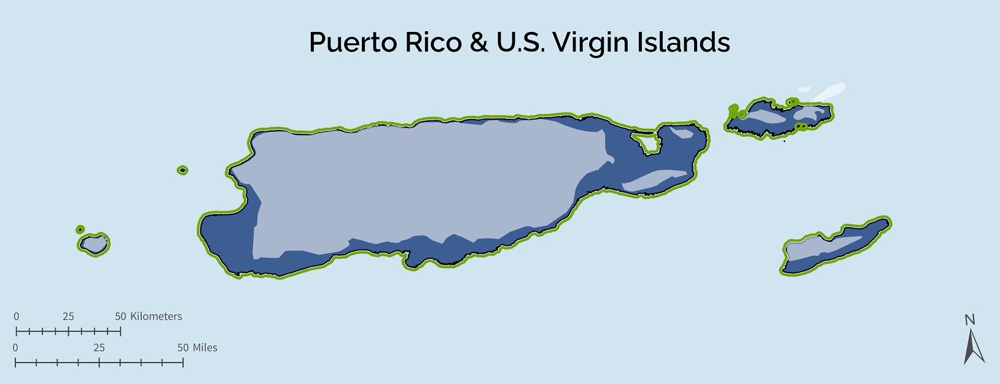

<blockquote>Workshops have wrapped up for Southeast Blueprint 2023! This page will be updated in the future for the next workshop series.</blockquote>

The Southeast Conservation Adaptation Strategy (SECAS) is a regional conservation initiative that spans the Southeastern United States and Caribbean. The primary product of SECAS is the Southeast Conservation Blueprint, a living, spatial plan that identifies priority areas for a connected network of lands and waters across the region. We regularly update the Blueprint based on new data and feedback from the conservation community. In 2023, the Blueprint update focuses on a) Puerto Rico, the U.S. Virgin Islands, and the surrounding marine environment and b) the deeper offshore waters of the Gulf of Mexico and Atlantic marine environments. <b>We need your feedback on the draft Blueprint!</b> Your input helps to ensure the Blueprint represents on-the-ground conditions and captures your conservation priorities. It also helps staff prioritize future improvements.

In May, we are hosting a series of 1.5-hour workshops via Zoom to review the draft Blueprint in Puerto Rico, U.S. Virgin Islands, and the offshore U.S. waters of the Atlantic Ocean and Gulf of Mexico. You will be able to zoom in on areas that you know and provide spatially explicit feedback on the draft Blueprint, capturing places that are underprioritized, overprioritized, and that you have questions about. Please note, some workshops are repeated to account for scheduling conflicts--_please only register for one workshop for a given area (the content will be the same in both)_. But if you want to attend workshops for different areas, feel free to register for more than one! Click on a registration link in the table below to sign up to attend.

<ul>
  <li>For more information about what changes you can expect to see with the 2023 update to the Southeast Blueprint, take a look at <a href="http://secassoutheast.org/2023/03/28/Likely-Blueprint-improvements-for-2023.html">this blog by SECAS Science Coordinator, Rua Mordecai</a>.</li>
  <li>To learn about the feedback we've received so far on an earlier draft of the Caribbean priorities, <a href="https://secassoutheast.org/2023/02/24/Caribbean-Community-of-Practice-kickoff-meeting-in-Christiansted-St-Croix.html">this blog by Alex Lamle of the Blueprint User Support team</a>.</li>
  <li>Would you like more information about the history of the Blueprint and how it is developed? <a href="http://secassoutheast.org/blueprint">Explore the Blueprint page of the SECAS website</a> or reach out to <a href="http://secassoutheast.org/staff">Blueprint User Support staff in your area</a>.</li>
  <li>Have questions about the workshops? Contact <a href="mailto:hilary_morris@fws.gov">hilary_morris@fws.gov</a>.</li>
  <li>Unable to attend any of the scheduled workshops? There will be an alternative way to provide feedback, so stay tuned for more information, or reach out to one of <a href="http://secassoutheast.org/staff">our Blueprint User Support staff</a> in the meantime.</li>
  </ul>
  

<h2>Register for a workshop</h2>

<table border="1" table cellpadding="7">
  <tr>
    <th>Date</th>
    <th>Time</th>
    <th>Subgeography</th>
    <th>Registration link</th>
  </tr>
   <tr>
     <td>May 17</td>
     <td>9 am ET</td>
     <td>U.S. Virgin Islands</td>
     <td><a href="https://doitalent.zoomgov.com/meeting/register/vJIsdO2tpj8vHz0RsSgW83O02BtZEg6p95w">Register via Zoom</a></td>
  </tr>
   <tr>
     <td>May 18</td>
     <td>10 am ET</td>
     <td>Puerto Rico & the U.S. Virgin Islands</td>
     <td><a href="https://doitalent.zoomgov.com/meeting/register/vJItd-qgqz0vHFL4eMPtPAEjBh-ODt1f6zY">Register via Zoom</a></td>
  </tr>
   <tr>
     <td>May 18</td>
     <td>1 pm ET</td>
     <td>Offshore Atlantic & Gulf waters</td>
     <td><a href="https://doitalent.zoomgov.com/meeting/register/vJItf-CprDsoG17FcTU4VTcS04IjkkDhXKs">Register via Zoom</a></td>
  </tr>
   <tr>
     <td>May 23</td>
     <td>9 am ET</td>
     <td>Puerto Rico</td>
     <td><a href="https://doitalent.zoomgov.com/meeting/register/vJIsfu2przstEu-3fcTBmQ2ivmTGoPWqvZQ">Register via Zoom</a></td>
  </tr>
   <tr>
     <td>May 23</td>
     <td>2 pm ET</td>
     <td>Offshore Gulf waters</td>
     <td><a href="https://doitalent.zoomgov.com/meeting/register/vJIscuCgpz4uHjKtiFrfpEJg4eYAQ23iyXo">Register via Zoom</a></td>
  </tr>
    <tr>
     <td>May 24</td>
     <td>10 am ET</td>
     <td>Offshore Atlantic & Gulf waters</td>
     <td><a href="https://doitalent.zoomgov.com/meeting/register/vJIsf-msqj8iE-ILv0-sABsVmHp0ZdT0eJc">Register via Zoom</a></td>
  </tr>
   <tr>
     <td>May 24</td>
     <td>1 pm ET</td>
     <td>Puerto Rico & the U.S. Virgin Islands</td>
     <td><a href="https://doitalent.zoomgov.com/meeting/register/vJIscu-hpzIiGHF-RoImOdXLABqvtc8aKto">Register via Zoom</a></td>
  </tr>
    <tr>
     <td>May 25</td>
     <td>10 am ET</td>
     <td>Offshore Atlantic waters</td>
     <td><a href="https://doitalent.zoomgov.com/meeting/register/vJIsc-6hqjkoGpKJjDAngwb2zSg4NJaYp_Q">Register via Zoom</a></td>
  </tr>
 </table>
 _Note: All times are shown in Eastern Time. Please adjust accordingly for your time zone._
   
   
<figure>
  
  <figcaption>Marine workshops for the contiguous Southeast will focus on reviewing the Blueprint in these areas. Note: the Atlantic workshops begin just outside of state waters. The Gulf workshops include significant portions of Texas and Florida state waters, and tiny slivers of the state waters of Louisiana, Mississippi, and Alabama.</figcaption>
</figure>
<figure>
  
  <figcaption>The Puerto Rico and U.S. Virgin Islands workshops will focus on reviewing the Blueprint on these islands and the surrounding nearshore marine waters.</figcaption>
</figure>
